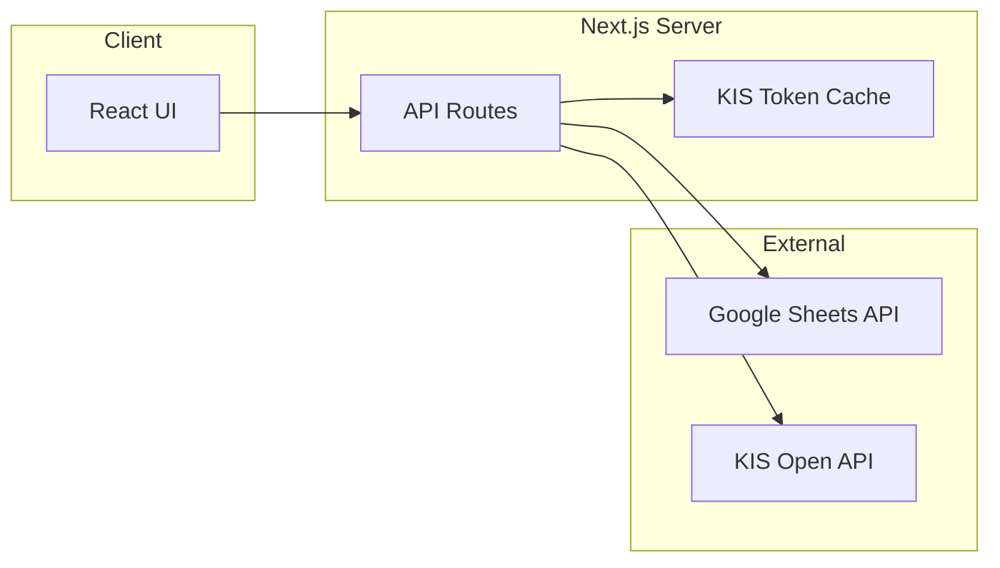

# Architecture: 국내주식 투자 지원 앱

본 문서는 [PRD.md](PRD.md)에 정의된 요구사항을 구현하기 위한 기술 아키텍처, 데이터 흐름, 폴더 구조, 핵심 모듈 책임을 정리합니다. 구현 시 참조용 단일 소스로 사용합니다.

---

## 1. 권장 기술 스택 (PRD 정합성)

| 영역 | 선택 | PRD 근거 |
|------|------|----------|
| **Framework** | Next.js (App Router) | PRD §6: Data Cache, API Route로 KIS 토큰/키 비노출 |
| **UI** | shadcn/ui + Tailwind CSS | PRD §5 |
| **차트** | Recharts | PRD §3.3 |
| **데이터 페칭/캐시** | TanStack Query (React Query) 또는 SWR | PRD §6: Rate Limit 방어, 캐싱 |
| **데이터 소스** | Google Sheets API (읽기/추가) | PRD §3.1 |
| **실시간 주가** | 한국투자증권 KIS Open API | PRD §3.2 |
| **소스 관리** | GitHub | 저장소 호스팅, 버전 관리 |
| **배포** | Vercel | Next.js 네이티브 배포, 서버리스 API Routes |

**백엔드 형태**: Next.js API Routes (Server)로 Google Sheets / KIS 호출을 감싸서, API 키·토큰을 클라이언트에 노출하지 않습니다. KIS 토큰 캐싱은 서버 메모리(또는 Redis 등)에서 처리합니다. **Vercel 배포 시** 서버리스 인스턴스는 요청 단위로 재시작될 수 있어 인메모리 캐시가 요청 간 유지되지 않을 수 있으므로, 토큰 재사용 빈도가 높으면 Vercel KV·Upstash Redis 등 외부 캐시 도입을 고려합니다.

---

## 2. Architecture Overview (아키텍처 개요)

클라이언트(React UI)는 Google Sheets API나 KIS API를 직접 호출하지 않습니다. 모든 외부 연동은 Next.js API Routes를 통해서만 이루어지며, 비밀/토큰은 서버에만 존재합니다.



---

## 3. Data Flow (데이터 흐름)

### 3.1. 시트 → 앱 (Read, PRD §3.1)

- 사용자가 구글 시트에 매매 내역을 입력/수정하면, 앱에서는 **주기 폴링** 또는 **사용자 새로고침** 시점에 반영합니다.
- API Route가 Google Sheets API를 호출해 시트 데이터를 읽고, 클라이언트는 TanStack Query(또는 SWR)로 해당 API를 소비합니다. 실시간 푸시는 PRD 범위 외이므로 폴링/온디맨드로 처리합니다.

### 3.2. 앱 → 시트 (Append, PRD §3.1)

- 앱 내에서 매매 기록 및 복기(저널링)를 추가할 때, 클라이언트는 API Route를 호출하고, API Route가 Google Sheets API의 **append** 로 마지막 행에 한 행을 추가합니다.

### 3.3. KIS 실시간 주가 및 포트폴리오 (PRD §3.2)

- **보유 종목 리스트**: 시트 데이터에서 "매수 − 매도" 수량으로 파생합니다.
- **종목코드 매핑**: `lib/ticker-mapping.ts`의 **getTickerCodeMap()**이 단일 진입점입니다. **(1) 종목코드 마스터 시트**(GOOGLE_SHEET_TICKER_MASTER) → **(2) 종목별 집계 시트**의 Code 컬럼(GOOGLE_SHEET_AGGREGATION) → **(3) 하드코딩 fallback**(ticker-mapping.ts) 순으로 조회합니다. 마스터/집계 시트 미설정이거나 해당 종목이 없으면 다음 소스를 사용합니다.
- **토큰 캐싱**: API Route 레이어에서 24시간 유효 Access Token을 서버 메모리(또는 Redis)에 캐싱하고, 만료 전에는 재발급하지 않습니다. Vercel에서는 인스턴스 메모리가 요청 간 공유되지 않을 수 있으므로, 필요 시 Vercel KV 등으로 캐시를 두는 방안을 검토합니다.
- **흐름**: API Route가 (1) 토큰 취득/캐시 조회 (2) getTickerCodeMap()으로 종목코드 매핑 (3) KIS 현재가 조회 (4) 총 매수 금액·현재 평가 금액·실시간 평가 손익 계산 후 클라이언트에 반환합니다.

### 3.4. KIS 종목정보·시세 → 종목 상세/목록 (PRD §3.3)

- **GET /api/kis/stock-info**: 쿼리 `code=` 또는 `ticker=`로 단일 종목의 KIS 현재가 확장(전일대비·시고저)·일봉 차트 기반 52주 최고/최저를 반환. `lib/kis-api.ts`의 `getPriceInfo()`, `getDailyChart()` 사용. 캐시: `Cache-Control: s-maxage=300, stale-while-revalidate=120`.
- **종목 상세 페이지**: `/dashboard/ticker/[id]`에서 위 API + 기존 analysis/portfolio/transactions 데이터를 조합해 시세·내 포트폴리오·참고 지표(52주 대비·보유 수익률 등)를 표시.
- **종목 목록**: 대시보드의 "종목별 분석" 섹션에서 보유/참고 뱃지·상세 링크 제공. 상세 페이지로 진입하는 메인 플로우.

### 3.5. DART 재무제표·비율 (가치투자 강화)

- **GET /api/dart/financials**: 쿼리 `code=`(6자리 종목코드), 선택 `currentPrice=`, `revalidate=1`. DART 전자공시 API로 대차대조표·손익계산서·재무비율(수익성·안정성·기타) 반환. `lib/dart-api.ts`의 getCorpCodeByStockCode, getFnlttSinglAcnt, computeRatios 사용.
- **캐시**: 서버는 `unstable_cache(..., { revalidate: 3600 })`로 1시간 캐시. `revalidate=1`이면 캐시 스킵 후 DART 재호출. 클라이언트는 React Query `staleTime` 30분, "재무·시세 갱신" 버튼으로 refetch + revalidate=1 전달.
- **환경 변수**: `DART_API_KEY` (opendart.fss.or.kr 인증키).

---

## 4. Application Structure (앱 구조)

Next.js App Router 기준 제안 폴더 구조입니다. PRD §6의 **빈 값 처리**는 `lib`의 normalize 유틸과 타입(optional 필드)으로 보장합니다.

```
app/
├── layout.tsx              # 전역 레이아웃, 테마 프로바이더
├── page.tsx                 # 진입(대시보드 리다이렉트 등)
├── dashboard/               # 대시보드 (지표 카드, 종목별 분석, 차트)
│   └── ticker/[id]/        # 종목 상세 페이지 (id = 종목코드 또는 종목명)
├── api/
│   ├── sheets/
│   │   ├── transactions/    # GET: 목록, POST: append
│   │   ├── ticker-master/  # GET: 종목코드 마스터 시트
│   │   └── aggregation/    # GET: 종목별 집계 시트
│   ├── kis/
│   │   ├── portfolio-summary/  # 보유 종목 평가 (토큰 캐싱, 매핑 호출)
│   │   └── stock-info/        # GET: 단일 종목 시세·52주 고저 (캐시 5분)
│   └── dart/
│       └── financials/        # GET: 재무제표·비율 (unstable_cache 1시간, revalidate=1 시 스킵)
lib/
├── google-sheets.ts         # Sheets API 읽기/append 래퍼
├── kis-api.ts               # KIS 인증, 현재가·getPriceInfo·getDailyChart, 토큰 캐시
├── dart-api.ts              # DART corpCode·fnlttSinglAcnt, 재무비율 계산
├── ticker-mapping.ts        # 종목명 ↔ 6자리 종목코드 매핑
└── normalize-row.ts        # 시트 Row 파싱 시 null/undefined → 0 또는 ""
components/
├── dashboard/               # SummaryCards, TickerAnalysisTable, TickerDetailContent, DashboardNav, 차트
├── transactions/            # 거래 테이블, 행 클릭 → 상세
├── journal/                 # 저널 모달 또는 사이드 시트, 에디터
└── ui/                      # shadcn/ui 컴포넌트
hooks/
├── useSheetData.ts          # 시트 매매 내역 조회 (React Query)
├── usePortfolioSummary.ts   # KIS 포트폴리오 요약
└── useTransactions.ts       # 거래 목록 + 상세
types/
├── sheet.ts                 # 시트 행 타입 (Date, Ticker, Type, ...)
└── api.ts                   # API 응답 타입
```

---

## 5. API Design (API 설계)

| Method | 경로 | 설명 |
|--------|------|------|
| GET | `/api/sheets/transactions` | 시트 매매 내역 반환. 클라이언트는 React Query 캐시 키로 소비. |
| POST | `/api/sheets/transactions` | Body: Date, Ticker, Type, Quantity, Price, Fee, Tax, Journal, Tags. 한 행 Append. |
| GET | `/api/sheets/ticker-master` | 종목코드 마스터 시트 조회 (GOOGLE_SHEET_TICKER_MASTER). 미설정 시 []. |
| GET | `/api/sheets/aggregation` | 종목별 집계 시트 조회 (GOOGLE_SHEET_AGGREGATION). 미설정 시 []. |
| GET | `/api/kis/portfolio-summary` | 보유 종목 + 현재가 → 총 매수금액, 평가금액, 평가손익 반환. 내부에서 토큰 캐싱·getTickerCodeMap() 호출. |
| GET | `/api/kis/stock-info?code=` 또는 `?ticker=` | 단일 종목 시세(전일대비·시고저)·52주 최고/최저 반환. 캐시 5분. 종목 상세 페이지·참고 지표용. |
| GET | `/api/dart/financials?code=` | DART 재무제표·비율(대차대조표, 손익계산서, 수익성/안정성/기타). 선택: currentPrice=, revalidate=1(캐시 스킵). |

**Rate Limit 대응 (PRD §6)**  
- 클라이언트: TanStack Query의 `staleTime`/`gcTime`(구 cacheTime)과 refetch 간격을 설정해 불필요한 재요청을 줄입니다.  
- 서버: KIS 호출 시 한 번에 요청하는 종목 수를 제한하거나, 구글 시트 read/append 빈도를 제한하는 방식으로 과도한 호출을 방지합니다.

---

## 6. Key Modules & Responsibilities (핵심 모듈)

| 모듈 | 책임 | PRD 연관 |
|------|------|----------|
| **ticker-mapping** | **getTickerCodeMap()**: (1) 종목코드 마스터 시트 (2) 종목별 집계 시트 Code 컬럼 (3) 하드코딩 fallback 순으로 종목코드 조회. KIS 호출 전 포트폴리오 요약에서 사용. | §3.2 종목코드 매핑 |
| **KIS token cache** | 24시간 유효 토큰을 서버 메모리(또는 키-값 저장소)에 저장, 만료 전 재발급 방지. | §3.2 토큰 캐싱 |
| **normalize-row** | 시트 Row 파싱 시 Fee, Tax, Journal 등 null/undefined → 0 또는 `""` 로 치환. | §6 빈 값 처리 |
| **장외 시간 처리** | KIS 응답이 마지막 종가를 주는 경우와 에러를 주는 경우를 구분해, 에러 시 "장 마감" 등으로 처리하고 크래시 방지. | §6 장외 시간 |

---

## 7. UI/UX Architecture (PRD §5)

- **반응형**: Mobile-first로 설계하여 데스크탑·모바일(아이폰/안드로이드)에서 동작하도록 합니다.
- **디자인**: shadcn/ui + Tailwind CSS. 다크/라이트 모드 및 **한국 주식 색상**(수익=빨강, 손실=파랑)은 Tailwind 테마/ CSS 변수로 정의합니다.
- **대시보드 (PRD §3.3)**: Summary Cards(총 실현손익, 현재 평가손익, 전체 승률, 총 자산) + Recharts 기반 차트(누적 수익금 추이, 종목별 실현 수익률, 매수/매도 비중·승률).
- **매매 복기 (PRD §3.4)**: 거래 행 클릭 시 상세 내역 모달 또는 사이드 시트에서 매매 사유·감정 상태·전략 태그 기록/열람 에디터 제공.

---

## 8. Security & Environment

- **환경 변수**: Google Sheets API 키, KIS app key/secret 등은 **서버 전용** 환경 변수로 두고, API Route에서만 사용합니다. 클라이언트 번들에 포함되지 않도록 합니다.
- **로컬**: `.env.local`에 값을 두고 Git에는 커밋하지 않습니다.
- **프로덕션(Vercel)**: Vercel 프로젝트 설정 → Environment Variables에서 동일 변수명으로 값을 등록합니다. 빌드·런타임 모두 서버에서만 노출됩니다.
- **아키텍처 원칙**: 클라이언트에는 Google Sheets / KIS를 직접 호출하는 코드가 없습니다. 모든 외부 연동은 Next.js API Routes를 경유합니다.

---

## 9. Source Control & Deployment

- **소스 관리**: **GitHub**에서 저장소를 호스팅하며, 버전 관리 및 협업에 사용합니다. 기본 브랜치(예: `main`) 푸시 시 Vercel과 연동해 자동 배포할 수 있습니다.
- **배포**: **Vercel**에 배포합니다. Next.js App Router 및 API Routes는 Vercel 서버리스 함수로 자동 배포되며, 빌드 명령(`build`), 출력 디렉터리 등은 Next.js 기본값을 따릅니다.
- **CI/CD**: GitHub 저장소를 Vercel 프로젝트에 연결하면, 푸시 시 자동 빌드·배포됩니다. 프로덕션 환경 변수는 Vercel 대시보드에서만 설정하고, 저장소에는 넣지 않습니다.

---

## 10. Error Handling & Constraints (PRD §6 요약)

| 제약 | 처리 레이어 | 요약 |
|------|-------------|------|
| **API Rate Limit** | API Route + 클라이언트 캐시 | 서버에서 호출 횟수/구간 제한; 클라이언트는 React Query staleTime/refetch 간격으로 완화. |
| **빈 값 (null/undefined)** | lib (normalize-row) + 타입 | 시트 Row 파싱 시 Fee/Tax/Journal 등 optional 필드를 0 또는 "" 로 Fallback. |
| **장외 시간 (KIS)** | lib (kis-api) + API Route | KIS 에러 시 마지막 종가 미반환 등으로 처리하고, "장 마감" 등 메시지로 UI에 표시. 크래시 방지. |

---

*문서 버전: 1.1 | 수정일: 2026-03-05 | GitHub 소스 관리, Vercel 배포 반영 | 기준: [PRD.md](PRD.md)*
*문서 버전: 1.2 | 수정일: 2026-03-06 | §3.4 KIS 종목정보·stock-info, §4 앱 구조(종목 상세·DashboardNav), §5 API(stock-info) 추가*
