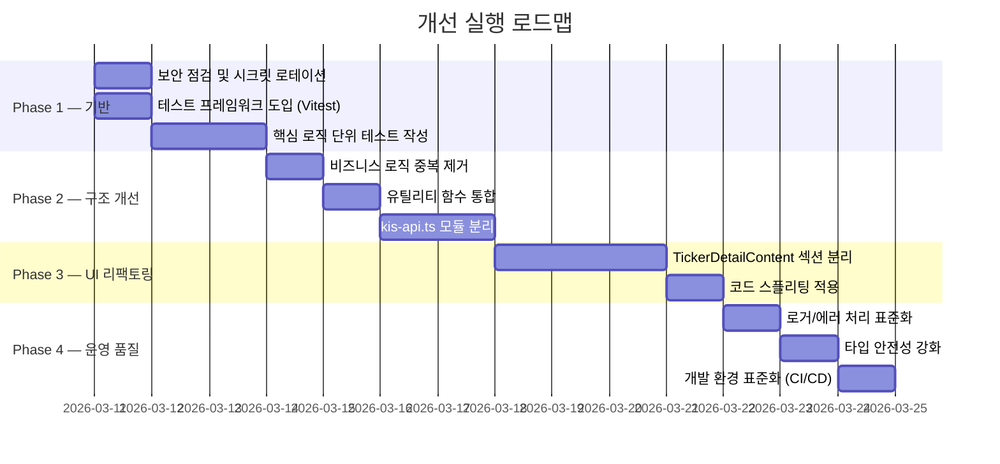

# 🔍 my-stock 프로젝트 개선 분석 보고서

## 개요

전체 소스코드를 **유지보수성**, **운영 안정성**, **확장성** 3가지 관점에서 심층 분석하여 10개의 개선 영역을 도출했습니다.

---

## 개선 요약 매트릭스

| # | 개선 영역 | 우선순위 | 난이도 | 관점 |
|---|-----------|----------|--------|------|
| 1 | God Component 분리 | 🔴 긴급 | 중 | 유지보수 |
| 2 | 핵심 모듈 분리 | 🔴 긴급 | 중 | 유지보수 |
| 3 | 비즈니스 로직 중복 제거 | 🟡 높음 | 낮 | 유지보수 |
| 4 | 유틸리티 함수 통합 | 🟡 높음 | 낮 | 유지보수 |
| 5 | 테스트 코드 도입 | 🔴 긴급 | 중 | 운영 |
| 6 | 에러 처리 및 로깅 표준화 | 🟡 높음 | 중 | 운영 |
| 7 | 타입 안전성 강화 | 🟢 보통 | 낮 | 유지보수 |
| 8 | 보안 강화 | 🟡 높음 | 낮 | 운영 |
| 9 | 성능 최적화 | 🟢 보통 | 중 | 확장성 |
| 10 | 개발 환경 표준화 | 🟢 보통 | 낮 | 확장성 |

---

## 1. 🔴 God Component 분리 — [TickerDetailContent.tsx](file:///e:/apps/my-stock/components/dashboard/TickerDetailContent.tsx) (2,317줄)

### 현황

[TickerDetailContent.tsx](file:///e:/apps/my-stock/components/dashboard/TickerDetailContent.tsx) 단일 파일에 **14개 섹션의 UI 로직, 데이터 변환 함수 40+개, 차트/테이블 렌더링, 스켈레톤, 상수 정의**가 모두 포함되어 있습니다.

```
TickerDetailContent.tsx (2,317줄, 115KB)
├── 유틸리티 함수 (~300줄): formatFundamentalNum, chartNum, normalizeDateStr, ...
├── 조회 상수/매핑 (~200줄): RATIO_LABELS, ESTIMATE_PERFORM_GROUPS, ...
├── 차트 데이터 빌더 (~200줄): buildInvestorCumulativeChartData, buildDailyOhlcChartData, ...
├── 스켈레톤 컴포넌트 (~80줄): FinancialSectionSkeleton, RatioSectionSkeleton, ...
├── 카드 렌더 함수 (~80줄): renderRatioKisCard
└── TickerDetailContentInner (~1400줄): 본문 전체 렌더
```

### 문제점

- **변경 영향 범위 파악 불가**: 시세 UI 수정 시 재무/차트 코드까지 스크롤해야 함
- **코드 리뷰 불가능**: PR 시 2,317줄 단일 diff
- **재사용 불가**: 차트 빌더, 포맷 함수들이 다른 곳에서 사용 불가
- **번들 사이즈**: 종목 상세 진입 시 115KB가 한 번에 로드

### 개선안

```
components/
├── ticker-detail/
│   ├── TickerDetailContent.tsx      # 오케스트레이터 (~200줄)
│   ├── sections/
│   │   ├── PriceHeroSection.tsx      # 시세 히어로
│   │   ├── ValuationSection.tsx      # 가치평가 PER/PBR
│   │   ├── FinancialSection.tsx      # KIS 재무 요약
│   │   ├── RatioSection.tsx          # 비율 카드 + 레이더/막대 차트
│   │   ├── EstimateSection.tsx       # 추정실적
│   │   ├── TradingTrendSection.tsx   # 매매동향 3종 차트
│   │   ├── OpinionSection.tsx        # 투자의견
│   │   ├── DartSection.tsx           # DART 손익/현금흐름/공시
│   │   ├── PortfolioSection.tsx      # 내 포트폴리오
│   │   ├── IndicatorSection.tsx      # RSI/MACD
│   │   ├── AiAnalysisSection.tsx     # AI 분석
│   │   └── JournalSection.tsx        # 매매 일지
│   ├── charts/
│   │   ├── OhlcChart.tsx
│   │   ├── InvestorCumulativeChart.tsx
│   │   └── DailyVolumeChart.tsx
│   ├── skeletons/
│   │   ├── FinancialSkeleton.tsx
│   │   ├── RatioSkeleton.tsx
│   │   └── TradeSkeleton.tsx
│   └── utils/
│       ├── formatters.ts             # formatFundamentalNum, formatRatioVal, ...
│       ├── chart-builders.ts         # buildInvestorCumulativeChartData, ...
│       └── constants.ts              # RATIO_LABELS, RATIO_KIS_GROUPS, ...
```

> [!TIP]
> 분리 시 `React.lazy()` + `Suspense`를 활용하면 14개 섹션을 **코드 스플리팅**하여 초기 로딩 115KB → ~30KB로 축소 가능

---

## 2. 🔴 핵심 모듈 분리 — [kis-api.ts](file:///e:/apps/my-stock/lib/kis-api.ts) (1,534줄)

### 현황

[kis-api.ts](file:///e:/apps/my-stock/lib/kis-api.ts) 파일 하나에 **토큰 관리, 캐시, 스로틀링, 15종 API 호출 함수**가 모두 존재합니다.

### 문제점

- 토큰 로직 수정 시 모든 API 함수에 영향 가능성
- 새 KIS API 추가 시 파일이 계속 비대해짐
- 토큰 캐시 전략 변경(Redis 등) 시 전체 파일 수정 필요

### 개선안

```
lib/kis/
├── token.ts              # 토큰 발급/캐시/갱신 (현재 ~200줄)
├── cache.ts              # 응답 캐시 (globalThis Map, TTL)
├── throttle.ts           # EGW00201 스로틀링
├── client.ts             # kisGet 공통 HTTP 클라이언트 + 토큰 재시도
├── price.ts              # getCurrentPrice, getPriceInfo, getDailyChart
├── financial.ts          # Balance Sheet, Income Statement, Ratios
├── opinion.ts            # 투자의견, 증권사별 투자의견
├── trading.ts            # 매매동향, 일별 체결량, 일봉
├── estimate.ts           # 추정실적
└── index.ts              # re-export (기존 import 경로 호환)
```

---

## 3. 🟡 비즈니스 로직 중복 제거

### 현황

**가중평균 매수원가 계산 로직**이 3개 파일에 거의 동일하게 중복 구현되어 있습니다:

| 파일 | 용도 | 핵심 로직 |
|------|------|-----------|
| [analysis.ts](file:///e:/apps/my-stock/lib/analysis.ts#L30-98) | 종목별 실현손익·승률 분석 | `costOfSold = buyValue * q / buyQty` |
| [portfolio-summary.ts](file:///e:/apps/my-stock/lib/portfolio-summary.ts#L37-84) | 현재 보유 포지션 계산 | 동일 |
| [analysis.ts](file:///e:/apps/my-stock/lib/analysis.ts#L157-205) | 누적 손익 시계열 | 동일 |

### 문제점

- 매수원가 계산 알고리즘 변경 시 **3곳을 동시에 수정해야 함** (실수 위험)
- 수수료·세금 처리 방식이 [analysis.ts](file:///e:/apps/my-stock/lib/analysis.ts)와 [portfolio-summary.ts](file:///e:/apps/my-stock/lib/portfolio-summary.ts)에서 **미묘하게 다름**

### 개선안

```typescript
// lib/position-tracker.ts (새 파일)
export class PositionTracker {
  private positions: Map<string, { qty: number; value: number }> = new Map();

  process(row: SheetTransactionRow): {
    ticker: string;
    realizedPnL?: number;  // 매도 시에만
    costOfSold?: number;
  } { /* 단일 구현 */ }

  getPosition(ticker: string): { qty: number; avgCost: number } { ... }
  getAllPositions(): PositionEntry[] { ... }
}
```

[computeAnalysis](file:///e:/apps/my-stock/lib/analysis.ts#23-148), [computePortfolioSummary](file:///e:/apps/my-stock/lib/portfolio-summary.ts#32-85), [computeCumulativePnl](file:///e:/apps/my-stock/lib/analysis.ts#154-206) 모두 이 클래스를 사용하도록 통합합니다.

---

## 4. 🟡 유틸리티 함수 통합

### 현황

[parseNum](file:///e:/apps/my-stock/app/api/fundamental/route.ts#33-38) 함수가 **3개 파일에 독립적으로 정의**되어 있습니다:

| 파일 | 위치 |
|------|------|
| [kis-api.ts](file:///e:/apps/my-stock/lib/kis-api.ts#L528-532) | `function parseNum(v: unknown): number` |
| [dart-api.ts](file:///e:/apps/my-stock/lib/dart-api.ts#L21-26) | `function parseNum(s: unknown): number` |
| [fundamental/route.ts](file:///e:/apps/my-stock/app/api/fundamental/route.ts#L33-37) | `function parseNum(v: unknown): number` |

[TickerDetailContent.tsx](file:///e:/apps/my-stock/components/dashboard/TickerDetailContent.tsx)에도 유사한 함수([chartNum](file:///e:/apps/my-stock/components/dashboard/TickerDetailContent.tsx#249-256), [toRatioNum](file:///e:/apps/my-stock/components/dashboard/TickerDetailContent.tsx#599-605))가 별도로 존재합니다.

### 개선안

```typescript
// lib/utils.ts에 통합
export function parseNum(v: unknown): number { ... }
export function chartNum(v: unknown): number { ... }
export function formatKRW(v: number): string { ... }
export function formatPercent(v: number, decimals?: number): string { ... }
export function formatDate(v: unknown, format?: string): string { ... }
```

---

## 5. 🔴 테스트 코드 도입

### 현황

> **테스트 파일 0개** — `*.test.*`, `*.spec.*` 파일이 **프로젝트 어디에도 없음**

- Jest/Vitest 등 테스트 러너 미설치
- [package.json](file:///e:/apps/my-stock/package.json)에 [test](file:///e:/apps/my-stock/lib/kis-api.ts#890-900) 스크립트 없음

### 위험성

- 매수원가 계산·실현손익·승률 등 **금융 계산 로직**이 검증 없이 운영 중
- KIS/DART API 응답 파싱 로직 변경 시 **사이드 이펙트 감지 불가**
- 리팩토링(위 1~4번) 진행 시 **기능 회귀 위험**

### 개선안 — 단계적 도입

#### Phase 1: 핵심 비즈니스 로직 (우선)

| 대상 | 테스트 내용 |
|------|-------------|
| [lib/analysis.ts](file:///e:/apps/my-stock/lib/analysis.ts) | 매수/매도 시나리오별 실현손익·승률 검증 |
| [lib/portfolio-summary.ts](file:///e:/apps/my-stock/lib/portfolio-summary.ts) | 보유 포지션·가중평균 매수원가 검증 |
| [lib/normalize-row.ts](file:///e:/apps/my-stock/lib/normalize-row.ts) | 시트 행 정규화 (빈값·타입 변환) |
| [lib/sort-transactions.ts](file:///e:/apps/my-stock/lib/sort-transactions.ts) | 날짜 정렬 정확성 |

#### Phase 2: 외부 API 파싱

| 대상 | 테스트 내용 |
|------|-------------|
| [lib/kis-api.ts](file:///e:/apps/my-stock/lib/kis-api.ts) | KIS 응답 JSON 파싱, 토큰 만료 감지 |
| [lib/dart-api.ts](file:///e:/apps/my-stock/lib/dart-api.ts) | DART 계정명 매칭, 비율 계산 |

#### Phase 3: API Route 통합 테스트

| 대상 | 테스트 내용 |
|------|-------------|
| `/api/analysis/summary` | 전체 분석 파이프라인 |
| `/api/kis/stock-info` | 파라미터 검증·에러 응답 |

```jsonc
// package.json 추가
{
  "scripts": {
    "test": "vitest run",
    "test:watch": "vitest",
    "test:coverage": "vitest run --coverage"
  },
  "devDependencies": {
    "vitest": "^3.x"
  }
}
```

---

## 6. 🟡 에러 처리 및 로깅 표준화

### 현황

| 문제 | 예시 |
|------|------|
| **console.log/warn/error 혼용** | [kis-api.ts](file:///e:/apps/my-stock/lib/kis-api.ts)에서 `console.log`와 `console.error`가 조건 없이 혼재 |
| **개발 환경 전용 로그** | `if (process.env.NODE_ENV === "development")` 체크가 30+곳에 산재 |
| **에러 메시지 미표준** | API Route마다 다른 형식의 에러 응답 (`{ error: string }`) |
| **에러 코드 없음** | 클라이언트에서 에러 유형 구분 불가 (모두 문자열 메시지만) |

### 개선안

#### 1) 구조화된 로거

```typescript
// lib/logger.ts
type LogLevel = "debug" | "info" | "warn" | "error";

export const logger = {
  debug: (module: string, msg: string, ...args: unknown[]) => {
    if (process.env.NODE_ENV === "development") console.log(`[${module}]`, msg, ...args);
  },
  info:  (module: string, msg: string, ...args: unknown[]) => console.info(`[${module}]`, msg, ...args),
  warn:  (module: string, msg: string, ...args: unknown[]) => console.warn(`[${module}]`, msg, ...args),
  error: (module: string, msg: string, ...args: unknown[]) => console.error(`[${module}]`, msg, ...args),
};
```

#### 2) API 에러 응답 표준화

```typescript
// lib/api-error.ts
interface ApiErrorResponse {
  error: string;
  code: string;          // "INVALID_CODE" | "KIS_UNAVAILABLE" | "SHEETS_ERROR" | ...
  details?: unknown;
}

export function apiError(code: string, message: string, status: number) {
  return NextResponse.json({ error: message, code }, { status });
}
```

---

## 7. 🟢 타입 안전성 강화

### 현황

| 문제 | 위치 |
|------|------|
| **`Record<string, unknown>` 과다 사용** | [kis-api.ts](file:///e:/apps/my-stock/lib/kis-api.ts) 전반 — KIS API 응답을 any-like로 처리 |
| **API Route에서 타입 직접 export** | [fundamental/route.ts](file:///e:/apps/my-stock/app/api/fundamental/route.ts)에서 [FundamentalApiResponse](file:///e:/apps/my-stock/app/api/fundamental/route.ts#67-72)를 export → Hook에서 import 시 서버/클라이언트 경계 혼동 |
| **`[key: string]: unknown` 인덱스 시그니처** | [KisBalanceSheetData](file:///e:/apps/my-stock/types/api.ts#198-208), [KisIncomeStatementData](file:///e:/apps/my-stock/types/api.ts#210-216) 등에서 타입 안전성 약화 |

### 개선안

```typescript
// types/api.ts에 모든 응답 타입 통합 (Route 파일에서 export하지 않음)
// Route 파일은 types/api.ts의 타입만 import해서 사용
```

```typescript
// KIS 응답 필드를 구체 타입으로 정의
interface KisFinancialRatioResponse {
  stac_yymm: string;
  grs: number;
  bsop_prfi_inrt: number;
  roe_val: number;
  eps: number;
  // ... 구체적 필드만
}
// Record<string, unknown> 대신 사용
```

---

## 8. 🟡 보안 강화

### 현황

| 위험 | 상세 |
|------|------|
| **서비스 계정 JSON 파일 저장소 포함 위험** | [my-stock-service-account.json](file:///e:/apps/my-stock/my-stock-service-account.json)이 [.gitignore](file:///e:/apps/my-stock/.gitignore)에 있지만, **이미 커밋된 이력이 있을 수 있음** |
| **환경 변수 노출** | [.env.local](file:///e:/apps/my-stock/.env.local)이 프로젝트 루트에 존재 ([.gitignore](file:///e:/apps/my-stock/.gitignore)에 포함됨을 확인) ✅ |
| **KIS 토큰 파일 캐시** | [.next/cache/kis-token.json](file:///e:/apps/my-stock/.next/cache/kis-token.json)에 평문 토큰 저장 |
| **CORS/Rate Limit 없음** | API Route에 요청 제한 없음 (인증된 사용자라도 무제한 호출 가능) |

### 개선안

```bash
# 1. 서비스 계정 파일 이력 확인 및 제거
git log --all -- my-stock-service-account.json
# 이력이 있다면 git-filter-repo로 제거 후 시크릿 로테이션

# 2. API Rate Limiting (middleware.ts 확장)
# next-auth 인증 후 IP/세션 기반 rate limit 추가
```

---

## 9. 🟢 성능 최적화

### 현황

| 문제 | 영향 |
|------|------|
| **`/api/fundamental` 직렬 호출** | 1단계(가격+DART) → 재무비율 → 2단계(11개 병렬) = **3번의 직렬 워터폴** |
| **DART 회사코드 ZIP 매번 전체 파싱** | 24시간 캐시이나 서버리스에서 cold start마다 ZIP(수MB) 다운로드 |
| **TickerDetailContent 번들** | 115KB 단일 컴포넌트가 코드 스플리팅 없이 로드 |
| **KIS API 순차 호출** | 스로틀 400ms × 종목당 10+개 API = 4초+ 지연 |

### 개선안

| 개선 | 방법 | 예상 효과 |
|------|------|-----------|
| 직렬 → 병렬화 | `Promise.all`을 한 단계로 통합 (의존성 있는 것만 순차) | 응답시간 30~40% 단축 |
| DART ZIP 캐시 | Vercel KV 또는 `/tmp` 파일 캐시로 ZIP 재다운로드 방지 | cold start 시 1~2초 절약 |
| 코드 스플리팅 | 섹션별 `React.lazy()` + `Suspense` | 초기 로드 70%+ 감소 |
| KIS 스로틀 최적화 | 인메모리 캐시 히트율 높이면 실제 API 호출 횟수 감소 | 이미 일부 적용됨 |

---

## 10. 🟢 개발 환경 표준화

### 현황

| 항목 | 상태 |
|------|------|
| **ESLint** | 설정 있음 (`eslint-config-next`) |
| **Prettier** | ❌ 미설정 (탭/스페이스, 줄바꿈 혼재) |
| **Husky / lint-staged** | ❌ 미설정 |
| **CI/CD 파이프라인** | ❌ GitHub Actions 없음 |
| **.nvmrc** | ✅ 있음 (Node 버전 고정) |

### 개선안

```jsonc
// package.json 추가
{
  "scripts": {
    "lint": "next lint",
    "format": "prettier --write 'app/**/*.{ts,tsx}' 'components/**/*.{ts,tsx}' 'lib/**/*.ts'",
    "prepare": "husky"
  },
  "devDependencies": {
    "prettier": "^3.x",
    "husky": "^9.x",
    "lint-staged": "^15.x"
  },
  "lint-staged": {
    "*.{ts,tsx}": ["eslint --fix", "prettier --write"]
  }
}
```

```yaml
# .github/workflows/ci.yml
name: CI
on: [push, pull_request]
jobs:
  check:
    runs-on: ubuntu-latest
    steps:
      - uses: actions/checkout@v4
      - uses: actions/setup-node@v4
        with: { node-version-file: .nvmrc }
      - run: npm ci
      - run: npm run lint
      - run: npm run build
      - run: npm test
```

---

## 실행 로드맵 (권장 순서)



> [!IMPORTANT]
> **Phase 1(기반)을 먼저 진행해야** Phase 2~3의 리팩토링 시 회귀 테스트로 안전성을 확보할 수 있습니다.
