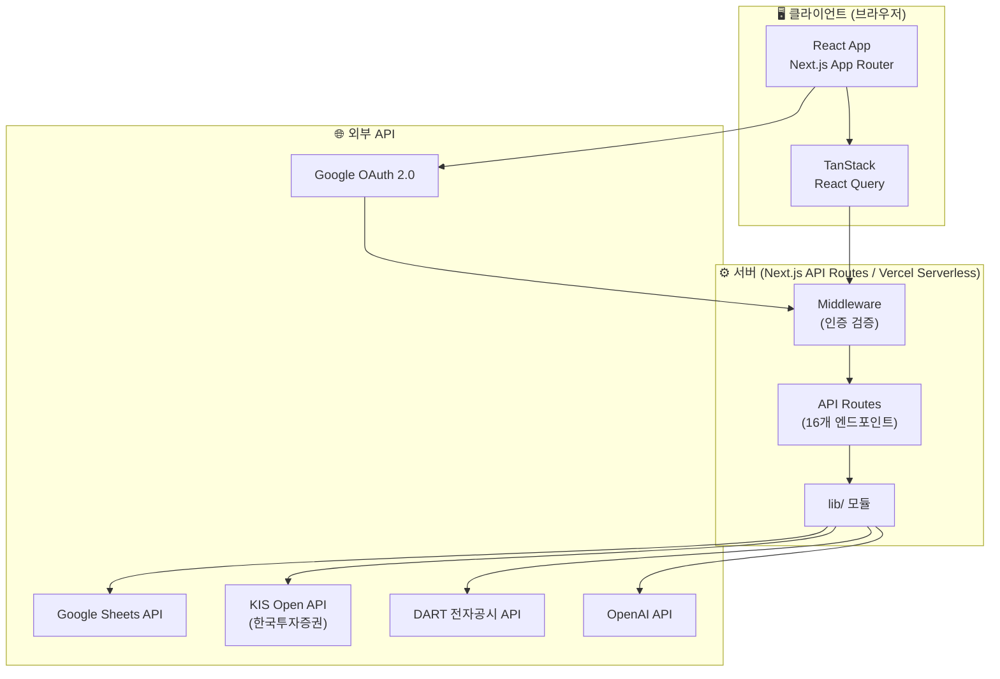
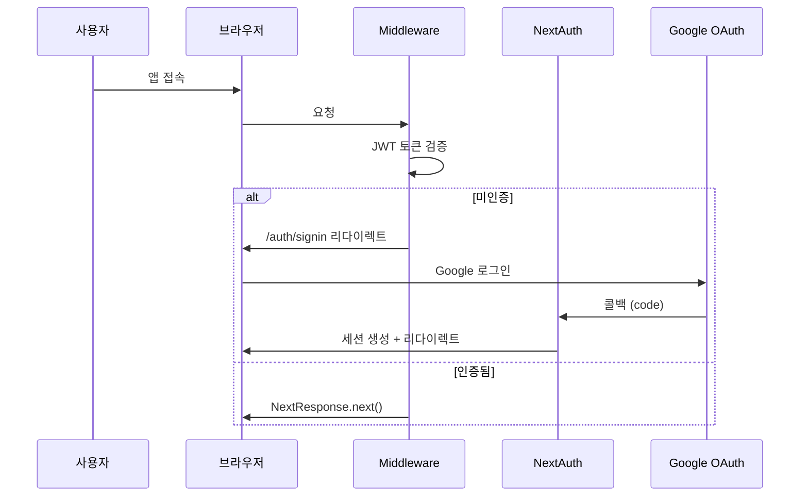
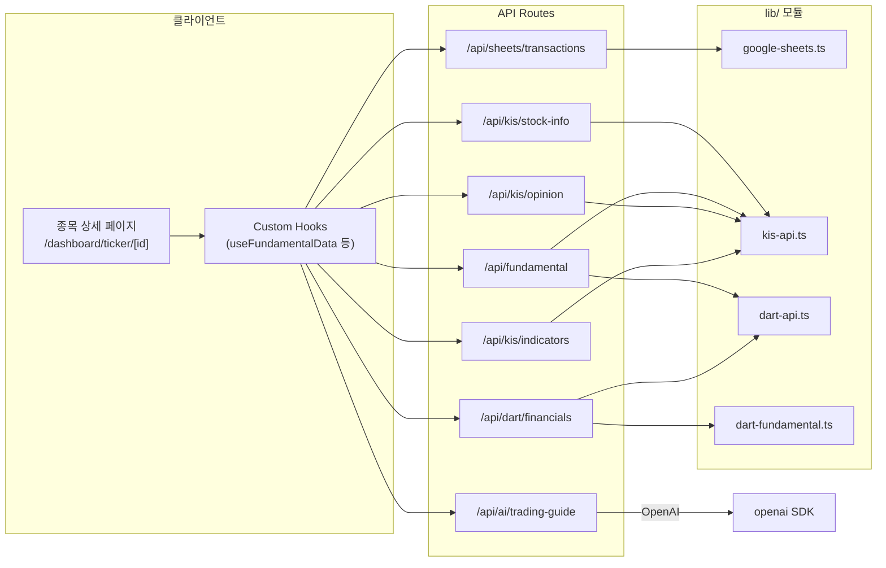
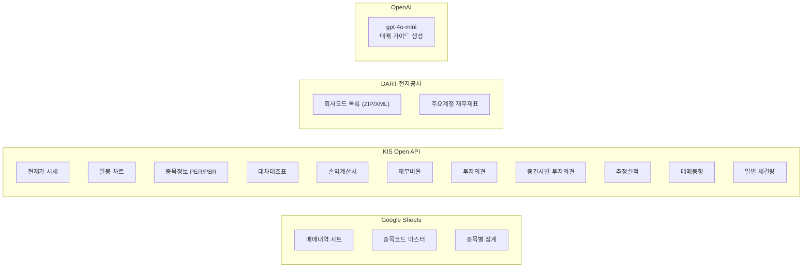
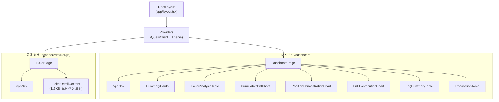
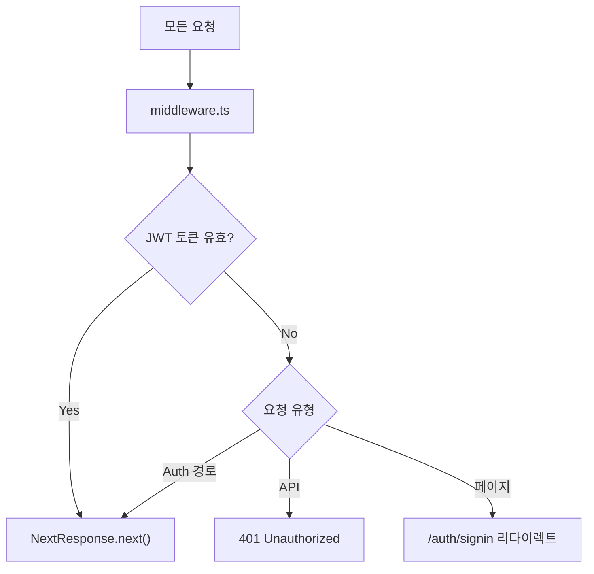
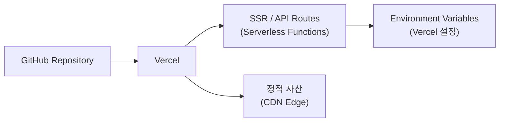

# 📊 my-stock 프로젝트 아키텍처 & 스펙 문서

## 1. 프로젝트 개요

**국내주식 투자 지원 웹 애플리케이션** — 개인 투자자를 위한 매매일지·포트폴리오 관리 대시보드

| 항목 | 내용 |
|------|------|
| **앱 이름** | 투자 지원 대시보드 |
| **버전** | 0.1.0 |
| **목적** | Google Sheets 매매 내역 기반 종목별 분석·인사이트 시각화 |
| **배포** | Vercel (서버리스) |
| **라이선스** | MIT |

---

## 2. 기술 스택

| 분류 | 기술 | 버전 |
|------|------|------|
| **프레임워크** | Next.js (App Router) | 15.5.10 |
| **언어** | TypeScript | ^5.6.0 |
| **런타임** | Node.js | ≥18.17.0 |
| **스타일링** | Tailwind CSS + shadcn/ui | ^3.4.15 |
| **상태관리** | TanStack React Query | ^5.90.21 |
| **차트** | Recharts | ^3.7.0 |
| **인증** | NextAuth.js (Google OAuth 2.0) | ^4.24.13 |
| **테마** | next-themes (다크/라이트) | ^0.4.6 |
| **AI** | OpenAI API (gpt-4o-mini) | ^6.27.0 |
| **마크다운** | react-markdown | ^10.1.0 |
| **아이콘** | lucide-react | ^0.577.0 |
| **압축** | adm-zip (DART 회사코드 XML) | ^0.5.16 |
| **인코딩** | iconv-lite | ^0.7.2 |

---

## 3. 아키텍처 구조도

### 3.1 전체 시스템 아키텍처



### 3.2 인증 흐름



### 3.3 데이터 흐름 (종목 상세)



---

## 4. 디렉토리 구조

```
my-stock/
├── app/                          # Next.js App Router
│   ├── layout.tsx                # 루트 레이아웃 (Providers)
│   ├── page.tsx                  # / → /dashboard 리다이렉트
│   ├── globals.css               # 디자인 토큰 (라이트/다크 테마)
│   ├── auth/
│   │   └── signin/page.tsx       # 로그인 페이지
│   ├── dashboard/
│   │   ├── page.tsx              # 메인 대시보드
│   │   ├── ticker/[id]/page.tsx  # 종목 상세 페이지
│   │   └── fundamental/          # (비어있음, 확장 예정)
│   └── api/                      # 16개 API Route
│       ├── ai/trading-guide/
│       ├── analysis/cumulative-pnl/
│       ├── analysis/summary/
│       ├── auth/[...nextauth]/
│       ├── auth/logout/
│       ├── dart/financials/
│       ├── fundamental/
│       ├── fundamental/financials/
│       ├── fundamental/valuation/
│       ├── kis/indicators/
│       ├── kis/opinion/
│       ├── kis/portfolio-summary/
│       ├── kis/stock-info/
│       ├── sheets/aggregation/
│       ├── sheets/ticker-master/
│       └── sheets/transactions/
├── components/                   # UI 컴포넌트
│   ├── AppNav.tsx                # 상단 네비게이션 바
│   ├── FundamentalDashboard.tsx  # 재무 대시보드 뷰
│   ├── providers.tsx             # QueryClient + ThemeProvider
│   ├── dashboard/                # 대시보드 전용 컴포넌트 (7개)
│   │   ├── SummaryCards.tsx
│   │   ├── TickerAnalysisTable.tsx
│   │   ├── CumulativePnlChart.tsx
│   │   ├── PositionConcentrationChart.tsx
│   │   ├── PnLContributionChart.tsx
│   │   ├── TagSummaryTable.tsx
│   │   └── TickerDetailContent.tsx  # 종목 상세 (115KB)
│   ├── journal/
│   │   └── JournalModal.tsx
│   └── transactions/
│       └── TransactionTable.tsx
├── hooks/                        # 커스텀 React 훅 (6개)
│   ├── useSheetData.ts
│   ├── useTransactions.ts
│   ├── useAnalysisSummary.ts
│   ├── useCumulativePnl.ts
│   ├── usePortfolioSummary.ts
│   └── useFundamentalData.ts
├── lib/                          # 서버 유틸리티 (12개)
│   ├── google-sheets.ts          # Google Sheets API 연동
│   ├── kis-api.ts                # KIS Open API 연동 (1534줄)
│   ├── dart-api.ts               # DART 전자공시 API
│   ├── dart-fundamental.ts       # DART 재무분석 로직
│   ├── analysis.ts               # 매매 분석 로직
│   ├── portfolio-summary.ts      # 포트폴리오 요약
│   ├── indicators.ts             # 보조지표 (RSI, MACD)
│   ├── ticker-mapping.ts         # 종목명 ↔ 종목코드 매핑
│   ├── normalize-row.ts          # 시트 행 정규화
│   ├── sort-transactions.ts      # 거래 정렬
│   ├── api-client.ts             # API 클라이언트 유틸
│   └── utils.ts                  # 공통 유틸 (cn)
├── types/                        # TypeScript 타입 정의
│   ├── api.ts                    # API 응답 타입 (263줄, 30+ 인터페이스)
│   ├── sheet.ts                  # 시트 스키마 타입
│   └── adm-zip.d.ts              # adm-zip 타입 선언
├── docs/                         # 문서 (39개 파일)
│   ├── PRD.md                    # 제품 요구사항 문서
│   ├── ARCHITECTURE.md           # 기술 아키텍처 문서
│   └── *.plan.md                 # 각종 구현 계획서
├── middleware.ts                 # 인증 미들웨어
├── next.config.mjs               # Next.js 설정
├── tailwind.config.ts            # Tailwind 설정
├── tsconfig.json                 # TypeScript 설정
└── package.json                  # 의존성 관리
```

---

## 5. API Route 구조

### 5.1 엔드포인트 목록

| 카테고리 | 경로 | 메서드 | 설명 |
|----------|------|--------|------|
| **인증** | `/api/auth/[...nextauth]` | GET/POST | NextAuth.js 핸들러 |
| | `/api/auth/logout` | GET | 로그아웃 |
| **시트** | `/api/sheets/transactions` | GET | 매매 내역 조회 |
| | `/api/sheets/ticker-master` | GET | 종목코드 마스터 조회 |
| | `/api/sheets/aggregation` | GET | 종목별 집계 데이터 |
| **분석** | `/api/analysis/summary` | GET | 종목별·전체 분석 요약 |
| | `/api/analysis/cumulative-pnl` | GET | 누적 손익 추이 |
| **KIS** | `/api/kis/stock-info` | GET | 종목 시세·52주 고저 |
| | `/api/kis/portfolio-summary` | GET | 포트폴리오 평가 손익 |
| | `/api/kis/opinion` | GET | 투자의견 (종목+증권사별) |
| | `/api/kis/indicators` | GET | 보조지표 (RSI, MACD) |
| **재무** | `/api/fundamental` | GET | 통합 재무 정보 |
| | `/api/fundamental/financials` | GET | KIS 재무제표 |
| | `/api/fundamental/valuation` | GET | 가치평가 지표 |
| | `/api/dart/financials` | GET | DART 재무제표·비율 |
| **AI** | `/api/ai/trading-guide` | POST | AI 분석·매매 가이드 |

### 5.2 외부 API 연동 상세



---

## 6. 핵심 모듈 상세

### 6.1 [lib/kis-api.ts](file:///e:/apps/my-stock/lib/kis-api.ts) — KIS Open API (1,534줄)

| 기능 | 설명 |
|------|------|
| **토큰 관리** | 24시간 유효 Access Token. 메모리 + globalThis + 파일 캐시 3중 전략 |
| **Rate Limit 대응** | EGW00133(1분 1회) 쿨다운, EGW00201(초당 제한) 스로틀링 (기본 400ms) |
| **응답 캐시** | 시세 60초, 재무/투자의견 300초 TTL 인메모리 캐시 |
| **토큰 만료 재시도** | EGW00123 수신 시 캐시 무효화 후 자동 재발급 |
| **TR ID 매핑** | 15개 TR ID → API 경로 매핑 테이블 |

### 6.2 [lib/google-sheets.ts](file:///e:/apps/my-stock/lib/google-sheets.ts) — Google Sheets API (299줄)

| 기능 | 설명 |
|------|------|
| **인증** | 서비스 계정 JWT 직접 서명 (google-auth-library 제거로 번들 경량화) |
| **CRUD** | `values.get`, `values.append`, `values.update` REST 직접 호출 |
| **3개 시트** | 매매내역, 종목코드 마스터, 종목별 집계 |

### 6.3 [lib/dart-api.ts](file:///e:/apps/my-stock/lib/dart-api.ts) — DART 전자공시 (314줄)

| 기능 | 설명 |
|------|------|
| **회사코드** | ZIP+XML 다운로드 후 종목코드(6자리) → corp_code(8자리) 매핑, 24시간 캐시 |
| **재무제표** | fnlttSinglAcnt API로 대차대조표·손익계산서 주요 계정 추출 |
| **비율 계산** | ROE, ROA, 영업이익률, 부채비율, 유동비율, PER, PBR 등 |

---

## 7. 컴포넌트 계층도



---

## 8. 페이지 구성

### 8.1 메인 대시보드 (`/dashboard`)

| 섹션 | 컴포넌트 | 데이터 소스 |
|------|----------|-------------|
| 요약 카드 | `SummaryCards` | analysis/summary + kis/portfolio-summary |
| 종목별 분석 | `TickerAnalysisTable` | analysis/summary |
| 누적 수익금 추이 | `CumulativePnlChart` | analysis/cumulative-pnl |
| 포지션 집중도 | `PositionConcentrationChart` | kis/portfolio-summary |
| 손익 기여도 | `PnLContributionChart` | kis/portfolio-summary |
| 전략별 성과 | `TagSummaryTable` | analysis/summary |
| 매매 내역 | `TransactionTable` | sheets/transactions |

### 8.2 종목 상세 (`/dashboard/ticker/[id]`)

14개 섹션을 [TickerDetailContent.tsx](file:///e:/apps/my-stock/components/dashboard/TickerDetailContent.tsx) (115KB) 단일 컴포넌트에서 렌더링:

> 시세 → 가치평가 → 재무(KIS) → 비율 → 추정실적 → 매매동향(3종 차트) → 투자의견 → DART 손익 → 현금흐름 → 공시 → 내 포트폴리오 → 보조지표(RSI/MACD) → AI 분석 → 매매 일지

---

## 9. 인증 및 보안



| 항목 | 설명 |
|------|------|
| **인증 방식** | NextAuth.js v4 + Google OAuth 2.0 |
| **토큰** | JWT (AUTH_SECRET 서명) |
| **접근 제한** | `ALLOWED_EMAIL` 환경변수로 특정 이메일만 허용 가능 |
| **보호 경로** | `/`, `/dashboard/**`, `/api/**` |
| **허용 경로** | `/api/auth/**`, `/auth/signin` |

---

## 10. 환경 변수 구성

| 그룹 | 변수 | 필수 | 설명 |
|------|------|------|------|
| **인증** | `AUTH_SECRET` | ✅ | NextAuth JWT 서명 키 |
| | `GOOGLE_CLIENT_ID` | ✅ | OAuth 클라이언트 ID |
| | `GOOGLE_CLIENT_SECRET` | ✅ | OAuth 클라이언트 시크릿 |
| | `ALLOWED_EMAIL` | ❌ | 허용 이메일 제한 |
| **Sheets** | `GOOGLE_SPREADSHEET_ID` | ✅ | 스프레드시트 ID |
| | `GOOGLE_SHEET_NAME` | ❌ | 시트 탭명 (기본: Sheet1) |
| | `GOOGLE_SHEET_TICKER_MASTER` | ❌ | 종목코드 마스터 시트 |
| | `GOOGLE_SHEET_AGGREGATION` | ❌ | 종목별 집계 시트 |
| **KIS** | `KIS_APP_KEY` | ✅ | KIS API 앱 키 |
| | `KIS_APP_SECRET` | ✅ | KIS API 앱 시크릿 |
| | `KIS_THROTTLE_MS` | ❌ | 요청 간격 (기본: 400ms) |
| **DART** | `DART_API_KEY` | ❌ | DART 인증키 (미설정 시 KIS만) |
| **AI** | `OPENAI_API_KEY` | ❌ | OpenAI API 키 |

---

## 11. 캐싱 전략

| 레벨 | 대상 | TTL | 구현 |
|------|------|-----|------|
| **클라이언트** | React Query | staleTime/gcTime | 자동 refetch |
| **서버 메모리** | KIS 시세 응답 | 60초 | globalThis Map |
| **서버 메모리** | KIS 재무/비율 | 300초 | globalThis Map |
| **서버 메모리** | KIS Access Token | 24시간 | globalThis + 변수 |
| **파일 캐시** | KIS Access Token | 24시간 | [.next/cache/kis-token.json](file:///e:/apps/my-stock/.next/cache/kis-token.json) |
| **서버 메모리** | DART 회사코드 | 24시간 | 모듈 변수 |

---

## 12. 디자인 시스템

| 항목 | 설명 |
|------|------|
| **UI 프레임워크** | shadcn/ui + Tailwind CSS |
| **테마** | CSS 변수 기반 라이트/다크 (`next-themes`) |
| **색상 체계** | 한국 주식 시장 관례: 수익=빨강(`--color-profit`), 손실=파랑(`--color-loss`) |
| **레이아웃** | 반응형 (Mobile-first, max-w-6xl 중앙 정렬) |
| **카드 스타일** | `rounded-2xl border shadow-sm` |
| **차트 색상** | 5개 커스텀 차트 색상 (`--chart-1` ~ `--chart-5`) |

---

## 13. 배포 아키텍처



> [!IMPORTANT]
> Vercel 서버리스 함수 250MB 제한 대응: `outputFileTracingExcludes`로 불필요한 googleapis 모듈·문서 제외. `serverExternalPackages`에 `adm-zip` 등록.
