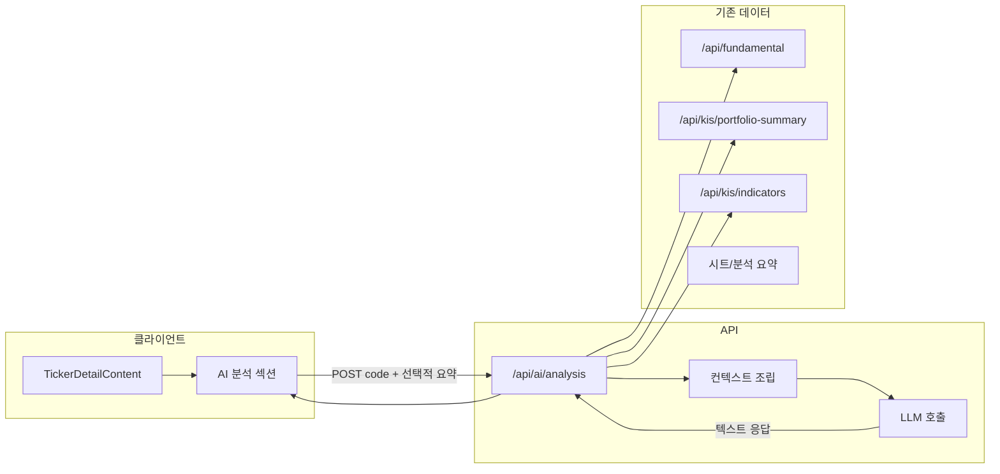

# 상세 정보 AI 분석 및 매매 가이드 기능 계획

## 목표

- **입력**: 해당 종목의 시세(KIS), 가치평가(PER/PBR/EPS·재무비율), 보조지표(RSI, MACD), **내 포트폴리오**(보유 수량·평균 단가·평가금액·평가손익·실현손익/승률)  
- **출력**: (1) 투자전략 요약 (2) 매매 가이드 (참고용 문구, 권유 아님)  
- **위치**: 종목 상세 페이지(`/dashboard/ticker/[id]`) 내 신규 섹션

## 아키텍처 개요

- 클라이언트는 이미 로드한 **fundamental / portfolio / indicators / analysis** 데이터를 그대로 활용해, **요약 JSON**만 서버로 보내거나, 서버에서 **code**만 받고 기존 API를 재호출해 컨텍스트를 조립하는 방식 중 하나 선택 가능.  
- **권장**: 서버에서 `code`만 받고 `/api/fundamental`, 포트폴리오·시트 데이터(또는 기존 `lib` 직접 호출)로 컨텍스트를 만든 뒤 LLM 호출. 클라이언트는 중복 요청 없이 일관된 스냅샷 기준 분석을 받을 수 있음.

## 1. 백엔드: AI 분석 API

**파일**: `app/api/ai/analysis/route.ts` (신규)

- **Method**: `POST`
- **Body**: `{ code: string }` (6자리 종목코드). 필요 시 `{ code, context?: ... }` 형태로 클라이언트가 미리 조립한 요약을 넘길 수 있도록 확장 가능.
- **동작**:
  1. `code` 검증(6자리, 000000 제외).
  2. **컨텍스트 조립**: 서버에서 해당 종목에 대해
    - 시세: 현재가·전일대비·52주 고/저 (기존 `getPriceInfo` 또는 fundamental 응답 활용).
    - 가치: PER, PBR, EPS, BPS, ROE, 부채비율 등 (fundamental KIS 비율).
    - 보조지표: RSI, MACD 요약 (indicators API 또는 직접 계산).
    - **내 포트폴리오**: 해당 종목 보유 수량·평균 단가·평가금액·평가손익·실현손익·승률 (portfolio-summary + analysis/sheets 기반). 보유 없으면 "미보유"로 명시.
  3. **프롬프트**: 시스템 프롬프트에서 "참고용이며 투자 권유가 아니다" 명시. 사용자 프롬프트에는 위 컨텍스트를 구조화된 텍스트(또는 짧은 JSON)로 넣고, "투자전략 요약"과 "매매 가이드" 두 블록으로 작성하라고 지시.
  4. **LLM 호출**: OpenAI Chat Completions API 사용 (`OPENAI_API_KEY`). 모델은 `gpt-4o-mini` 또는 `gpt-4o`(환경 변수로 선택 가능).
  5. **응답**: `{ strategy: string, guide: string }` 또는 하나의 `content: string`(마크다운) 반환. 에러 시 503 + 메시지.
- **보안/비용**: 라우트는 기존 미들웨어로 인증됨. 요청당 토큰 사용량을 줄이기 위해 컨텍스트는 요약 위주로만 구성. (선택) 동일 `code`에 대해 짧은 TTL 캐시(예: 1시간)를 메모리 또는 KV에 두어 중복 호출 감소.

**환경 변수**: `.env.example` 및 문서에 `OPENAI_API_KEY` 추가. (선택) `OPENAI_AI_MODEL=gpt-4o-mini` 등.

## 2. 프론트엔드: 상세 페이지 섹션

**파일**: [components/dashboard/TickerDetailContent.tsx](components/dashboard/TickerDetailContent.tsx)

- **신규 섹션**: "AI 분석 및 매매 가이드" (`#section-ai-guide`).
  - 위치: 기존 "이 페이지 내 섹션" 네비에 링크 추가 후, **내 포트폴리오** 위나 **보조지표** 다음 등 논리적 위치에 블록 배치.
- **UI 동작**:
  - **버튼**: "AI 분석 요청" (또는 "투자전략·매매 가이드 생성"). 클릭 시 `POST /api/ai/analysis`에 `{ code }` 전송. (이미 상세에서 `code` 확보 가능.)
  - **로딩**: 요청 중 스피너/플레이스홀더.
  - **결과**: 전략 요약 + 매매 가이드를 카드/텍스트 영역에 표시. 마크다운 지원 시 `content`를 렌더링하거나, `strategy`/`guide`가 있으면 각각 제목과 본문으로 표시.
  - **에러**: 503/네트워크 에러 시 "분석을 불러올 수 없습니다. 잠시 후 다시 시도해 주세요." 등 안내.
- **면책 문구**: 섹션 하단에 "본 내용은 AI 생성 참고용이며, 투자 권유가 아닙니다." 고정 표시.

**데이터**: `code`는 기존 `stockInfoQuery.data?.code` 또는 `fundamentalData`에서 가져옴. 별도 새 훅(예: `useAiAnalysis(code)`)에서 `mutation`으로 POST 후 결과를 상태에 저장해 표시하는 방식으로 구현 가능.

## 3. 타입 및 문서

- **타입**: [types/api.ts](types/api.ts)에 `AiAnalysisResponse { strategy?: string; guide?: string; content?: string }` 추가 (API 응답 형식에 맞춤).
- **PRD**: [docs/PRD.md](docs/PRD.md) §3.3 종목 상세에 다음 내용 추가:
  - **AI 분석 및 매매 가

