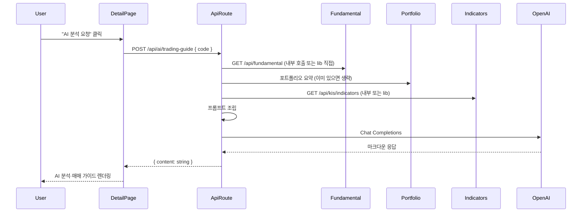

# 상세 정보 AI 분석 및 매매 가이드 기능 계획

## 목표

- 종목 상세 페이지에서 **시세(KIS)·가치평가(PER/PBR 등)·보조지표(RSI, MACD)** 와 **내 포트폴리오(해당 종목 보유 현황)** 를 바탕으로 OpenAI가 **투자전략 요약** 및 **매매 가이드(참고)** 를 생성하도록 한다.
- 모든 OpenAI 호출은 **서버 API 라우트**에서만 수행하고, API 키는 클라이언트에 노출하지 않는다.

## 아키텍처 개요

## 1. 환경 변수 및 의존성

- **환경 변수**: `.env.example` 및 문서에 `OPENAI_API_KEY` 추가. (Vercel 배포 시 Environment Variables에 등록)
- **패키지**: `openai` 공식 SDK 추가 (`npm install openai`). Edge 호환성 이슈가 있으면 서버 라우트에서만 사용하므로 Node 런타임으로 동작하면 됨.

## 2. API 라우트 설계

**엔드포인트**: `POST /api/ai/trading-guide`

- **요청**: `{ code: string }` (6자리 종목코드). 선택적으로 `ticker?: string` (표시용 종목명).
- **동작**:
  1. 인증: 기존 미들웨어로 보호된 라우트이므로 로그인 사용자만 호출 가능.
  2. 서버에서 해당 종목 데이터 수집:
    - **시세·가치·재무·투자의견**: `[app/api/fundamental/route.ts](app/api/fundamental/route.ts)`의 로직 재사용(동일 `code`로 `getPriceInfo`, `getKisStockFundamentals`/`getKisFinancialRatio`, `getInvestmentOpinion` 등 호출) 또는 내부 `fetch(process.env.VERCEL_URL + "/api/fundamental?code=...")`로 조회. 재사용 시 `[lib/kis-api.ts](lib/kis-api.ts)`, `[lib/dart-fundamental.ts](lib/dart-fundamental.ts)` 직접 호출해 한 번에 모으는 방식 권장(레이턴시·캐시 일관성).
    - **보조지표**: `[lib/kis-api.ts](lib/kis-api.ts)` `getDailyChart` + `[lib/indicators.ts](lib/indicators.ts)` `getTechnicalIndicators`로 RSI/MACD 계산, 또는 기존 `/api/kis/indicators?code=...` 내부 호출.
    - **포트폴리오**: `[lib/portfolio-summary.ts](lib/portfolio-summary.ts)` 기반으로 전체 포트폴리오 요약을 구한 뒤, 해당 `code`에 대응하는 종목(티커 매핑으로 code→ticker 또는 positions에서 ticker로 검색)의 보유 수량·매수금액·평가금액·평가손익 추출.
  3. **프롬프트 구성**:
    - **시스템 메시지**: “한국 주식 참고용 분석 어시스턴트. 제공된 데이터만으로 투자전략 요약과 매매 가이드(참고)를 작성한다. 매수/매도 권유 문구는 사용하지 않는다.”
    - **사용자 메시지**: 수집한 데이터를 **구조화된 텍스트/JSON 요약**으로 전달. 포함 권장 항목:
      - 종목: 이름, 코드, 현재가, 전일대비, PER, PBR, EPS, BPS
      - KIS 투자의견: 의견명, 목표가, 전망 요약
      - 재무 요약: 최근 매출·영업이익·당기순이익 추이(있으면), 주요 비율(ROE, 부채비율 등)
      - 보조지표: RSI, MACD(최근 값)
      - 내 포트폴리오: 해당 종목 보유 수량, 평균 단가, 평가금액, 평가손익(금액·수익률)
    - 출력 형식: **마크다운**으로 “투자전략 요약”, “매매 가이드(참고)”, “리스크 요인” 등 섹션 구분 지시.
  4. **OpenAI 호출**: `openai.chat.completions.create()` 사용. 모델은 `gpt-4o-mini`(비용·속도 균형) 또는 `gpt-4o`(품질 우선). `response_format: { type: "text" }` 또는 기본으로 마크다운 텍스트 반환.
  5. **응답**: `{ content: string }` (마크다운 본문). 에러 시 `{ error: string }` + 4xx/5xx.

**타임아웃**: OpenAI 호출 + 데이터 수집이 길 수 있으므로 루트 라우트에서 적절한 `maxDuration`(예: 30초) 설정 검토(Vercel Pro 시 함수 제한 상향 가능).

## 3. 상세 페이지 UI

- **위치**: `[components/dashboard/TickerDetailContent.tsx](components/dashboard/TickerDetailContent.tsx)` 내에서 기존 섹션(예: “참고 지표”, “최근 매매 일지”) 근처에 **“AI 분석 및 매매 가이드”** 섹션 추가.
- **동작**:
  - 해당 종목의 `code`(및 필요 시 `ticker`)는 이미 `TickerDetailContent`에서 `useFundamentalData(code)`, `usePortfolioSummary()` 등으로 보유 중.
  - “AI 분석 요청” 버튼: 클릭 시 `POST /api/ai/trading-guide`에 `{ code }` 전송. 로딩 중에는 스피너 또는 플레이스홀더 표시.
  - 응답 `content`를 **마크다운 렌더링**하여 표시. (예: `react-markdown` 패키지 사용 또는 기존 프로젝트에 마크다운 컴포넌트가 있으면 재사용.)
- **캐시/재요청**: 같은 상세 페이지에서 “다시 분석” 버튼으로 재호출 가능하게 하면 됨. 초기에는 별도 캐시 없이 요청 시마다 새로 생성해도 무방.

## 4. 타입 및 에러 처리

- **타입**: `POST /api/ai/trading-guide` 요청 body `{ code: string; ticker?: string }`, 응답 `{ content: string } | { error: string }`를 `[types/api.ts](types/api.ts)` 또는 라우트 인근에 정의.
- **에러**: `OPENAI_API_KEY` 미설정, OpenAI API 오류(할당량·네트워크), 데이터 수집 실패 시 각각 명확한 메시지로 `error` 반환하고, 클라이언트에서는 “분석을 불러올 수 없습니다: {message}” 등으로 표시.

## 5. 문서화 및 PRD 반영

- `[docs/PRD.md](docs/PRD.md)`의 “종목 상세 페이지” 또는 “종목별 분석” 항목에 **AI 분석 및 매매 가이드** 설명 추가: 시세·가치·보조지표·내 포트폴리오를 참고로 투자전략 요약 및 매매 가이드(참고)를 제공하며, OpenAI API를 사용하며 매수/매도 권유는 하지 않는다는 점 명시.
- `[.env.example](.env.example)`에 `OPENAI_API_KEY=` 및 주석(OpenAI API 키, 사용 모델은 코드 내 기본값) 추가.

## 6. 구현 순서 제안

1. **의존성 및 env**: `openai` 설치, `.env.example`에 `OPENAI_API_KEY` 추가.
2. **API 라우트**: `app/api/ai/trading-guide/route.ts` 구현 — 데이터 수집(기존 lib/API 활용), 프롬프트 조립, OpenAI 호출, `{ content }` 반환.
3. **타입**: 요청/응답 타입 정의.
4. **UI**: `TickerDetailContent`에 “AI 분석 및 매매 가이드” 섹션 + 요청 버튼 + 로딩/에러 상태 + 마크다운 렌더링.
5. **PRD 및 문서**: 위 내용 반영.

## 7. 주의사항

- **용량**: OpenAI SDK는 서버 라우트에서만 사용하고, `next.config.mjs`의 `outputFileTracingExcludes`로 불필요한 파일이 서버 번들에 포함되지 않도록 기존 설정 유지. 250MB 제한 이슈가 재발하면 해당 라우트만 외부화하는 것도 방법.
- **비용**: `gpt-4o-mini` 사용 시 토큰당 비용이 낮으므로, 프롬프트 길이는 “요약” 수준으로 유지해 입력 토큰을 과도하게 늘리지 않도록 한다.
- **정책**: 프롬프트에 “매수/매도 권유 금지, 참고용만 제공”을 명시해 출력 톤을 제한한다.

