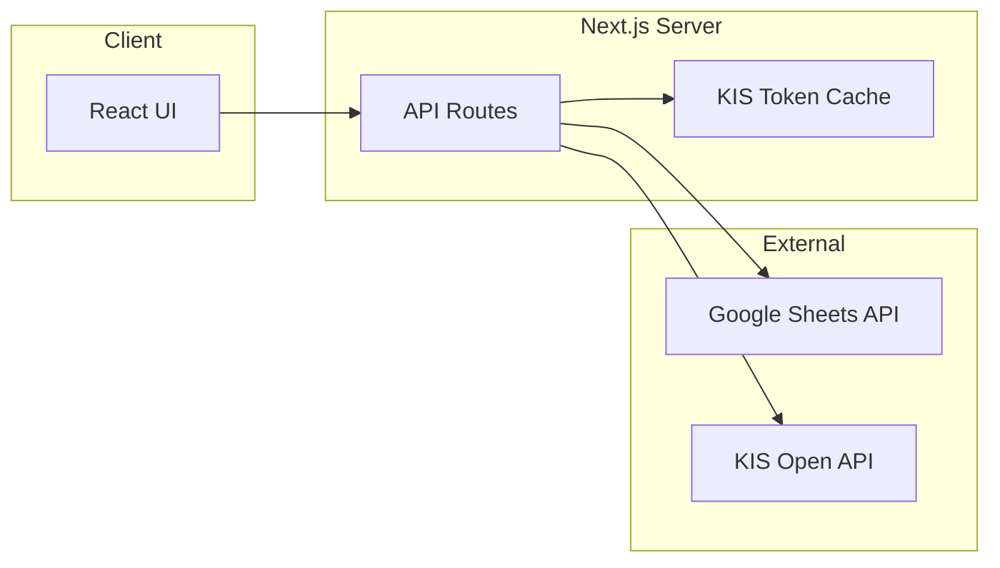

# ARCHITECTURE.md 작성 계획

## 문서 목적

[docs/PRD.md](docs/PRD.md)에 정의된 주식 매매일지 대시보드 앱을 **가장 잘 구현할 수 있도록** 기술 아키텍처, 데이터 흐름, 폴더 구조, 주요 모듈 책임을 한 문서에 정리한다. 실제 코드 작성 시 참조용 단일 소스가 되도록 한다.

---

## 1. 권장 기술 스택 (PRD 정합성)

| 영역            | 선택                                  | PRD 근거                                      |
| ------------- | ----------------------------------- | ------------------------------------------- |
| **Framework** | Next.js (App Router)                | PRD §6: Data Cache, API Route로 KIS 토큰/키 비노출 |
| **UI**        | shadcn/ui + Tailwind CSS            | PRD §5                                      |
| **차트**        | Recharts                            | PRD §3.3                                    |
| **데이터 페칭/캐시** | TanStack Query (React Query) 또는 SWR | PRD §6: Rate Limit 방어, 캐싱                   |
| **데이터 소스**    | Google Sheets API (읽기/추가)           | PRD §3.1                                    |
| **실시간 주가**    | 한국투자증권 KIS Open API                 | PRD §3.2                                    |

**백엔드 형태**: Next.js API Routes (Server)로 Google Sheets / KIS 호출을 감싸서, API 키·토큰을 클라이언트에 노출하지 않도록 한다. KIS 토큰 캐싱은 서버 메모리(또는 Redis 등)에서 처리한다.

---

## 2. 문서에 넣을 섹션 구성

### 2.1. Architecture Overview (아키텍처 개요)

- **High-level diagram**: 사용자 ↔ Next.js(Web + API) ↔ Google Sheets / KIS API 관계를 Mermaid로 표현.
- **역할 분리**: 브라우저(React)는 시트/KIS를 직접 호출하지 않고, Next.js API Routes를 통해서만 데이터를 주고받는다고 명시.

### 2.2. Data Flow (데이터 흐름)

- **시트 → 앱**: 주기 폴링 또는 사용자 새로고침 시 API Route가 Sheets API를 호출해 시트 데이터를 읽고, 클라이언트는 React Query로 해당 API를 소비. (실시간 푸시는 PRD에 없으므로 폴링/온디맨드로 명시.)
- **앱 → 시트**: 매매 기록/저널 추가 시 API Route를 통해 Sheets API `append` 호출.
- **KIS**: 보유 종목 리스트를 시트에서 파생 → 종목코드 매핑(한글명→6자리) → API Route에서 토큰 캐싱 후 현재가 조회 → 평가금액/평가손익 계산 후 클라이언트에 반환.

PRD의 **종목명↔종목코드 매핑**과 **토큰 캐싱**을 아키텍처 상에서 어디서 수행할지(매핑: 서버 유틸, 캐싱: API Route 레이어) 명시.

### 2.3. Application Structure (앱 구조)

- **Next.js App Router** 기준 제안 폴더 구조:
  - `app/`: 페이지 (dashboard, journal 등), 레이아웃, 로딩/에러.
  - `app/api/`: `sheets/`, `kis/` 등 API Route 그룹.
  - `lib/`: `google-sheets.ts`, `kis-api.ts`, `ticker-mapping.ts`(종목코드 매핑), `normalize-row.ts`(빈 값 Fallback).
  - `components/`: 대시보드 카드, 차트(Recharts 래퍼), 거래 테이블, 저널 모달/사이드시트.
  - `hooks/`: useSheetData, usePortfolioSummary 등.
  - `types/`: 시트 행 타입, API 응답 타입.
- PRD의 **빈 값 처리**는 `lib`의 normalize 유틸과 타입(optional 필드)으로 보장한다고 명시.

### 2.4. API Design (API 설계)

- **GET /api/sheets/transactions**: 시트 매매 내역 반환 (React Query 캐시 키).
- **POST /api/sheets/transactions**: 한 행 Append (Body: Date, Ticker, Type, Quantity, Price, Fee, Tax, Journal, Tags).
- **GET /api/kis/portfolio-summary**: 보유 종목 + 현재가 → 총 매수금액, 평가금액, 평가손익 반환. (내부에서 토큰 캐싱, 종목코드 매핑 호출.)
- 필요 시 **GET /api/kis/price?ticker=...** 같은 단일 종목 현재가 API 추가 가능하다고만 언급.

Rate Limit 대응: React Query의 `staleTime`/`cacheTime`과 refetch 간격, 서버 측에서 KIS 호출 횟수 제한(한 번에 N개 종목만 요청 등)을 ARCHITECTURE에 간단히 기술.

### 2.5. Key Modules & Responsibilities (핵심 모듈)

- **Ticker mapping**: 한글 종목명 ↔ 6자리 종목코드 딕셔너리(또는 JSON/DB). KIS 호출 전에 `lib/ticker-mapping.ts`에서 코드로 변환.
- **KIS token cache**: 24시간 유효 토큰을 메모리(또는 키-값 저장소)에 저장하고, 만료 전에는 재발급하지 않음.
- **Data normalization**: 시트 Row 파싱 시 Fee/Tax/Journal 등 null·undefined → 0 또는 `""` 로 치환 (PRD §6).
- **장외 시간**: KIS 응답이 마지막 종가를 주는 경우와 에러를 주는 경우를 구분해, 에러 시 “장 마감” 등으로 처리하고 크래시 방지.

### 2.6. UI/UX Architecture (선택, 간단히)

- Mobile-first, 반응형 레이아웃.
- 다크/라이트 + 한국 주식 색상(수익=빨강, 손실=파랑)은 Tailwind 테마/변수로 정의한다고 한 줄로 정리.

### 2.7. Security & Environment

- Google Sheets API 키, KIS app key/secret 등은 서버 전용 환경 변수. API Route에서만 사용.
- 클라이언트에는 시트/KIS를 직접 호출하는 코드가 없음을 아키텍처 원칙으로 명시.

### 2.8. Error Handling & Constraints (요약)

- PRD §6의 Rate Limit, 빈 값, 장외 시간을 각각 어떤 레이어(API, lib, UI)에서 처리할지 1~2문장으로 요약.

---

## 3. 문서 작성 시 유의사항

- **실제 파일/폴더명**은 위와 같이 구체적으로 제안하되, 프로젝트가 생성된 뒤 구조가 바뀌면 ARCHITECTURE.md만 갱신하면 되도록 작성.
- Mermaid는 PRD의 “가장 잘 구현”에 초점을 맞춰 **시스템 경계**와 **데이터 방향**만 그리며, 노드명에는 공백/특수문자 사용 시 따옴표로 감싼다.
- PRD의 모든 Core Features(§3.1~§3.4)와 제약사항(§6)이 아키텍처에서 **한 번 이상** 언급되도록 한다.

---

## 4. 결과물

- **파일**: [docs/ARCHITECTURE.md](docs/ARCHITECTURE.md) (신규 생성).
- **형식**: 마크다운, 헤딩은 PRD와 유사한 번호/계층 사용.
- **분량**: 위 섹션을 채우면 약 2~3페이지 분량으로, 구현 시 참고하기에 충분한 수준으로 유지.

이 계획대로 ARCHITECTURE.md를 작성하면 PRD를 가장 잘 구현할 수 있는 기술 설계가 한 문서에 정리된다.