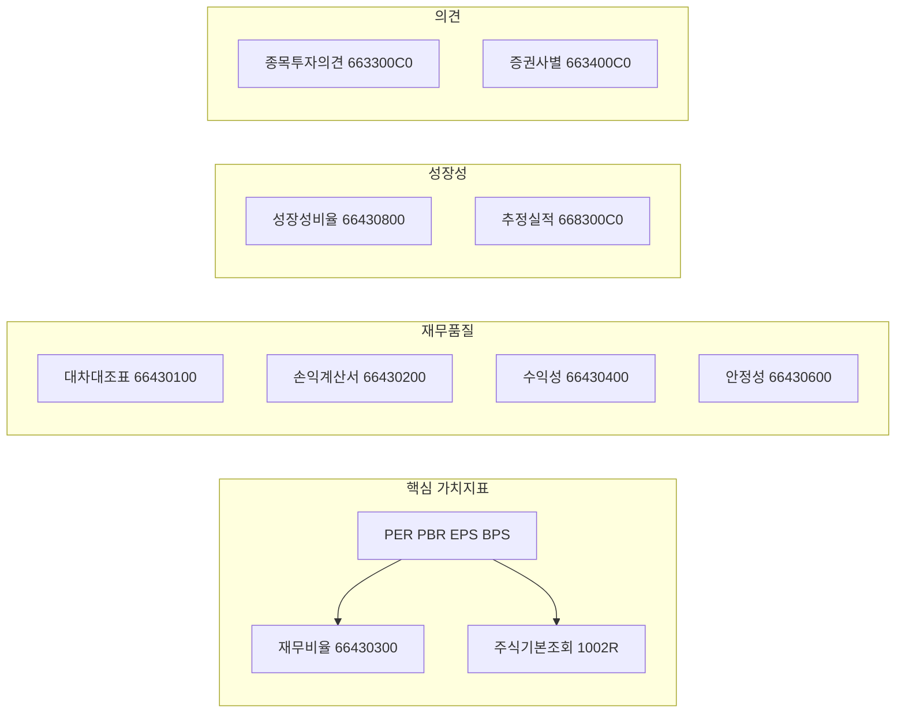

# KIS API 전면 재검토 — 가치투자용 지표 연동

## 1. 제공 TR · URL 매핑 (확정)

| TR_ID         | 한글명             | URL path                                                               |
| ------------- | --------------- | ---------------------------------------------------------------------- |
| CTPF1604R     | 상품기본조회          | GET `/uapi/domestic-stock/v1/quotations/search-info`                   |
| CTPF1002R     | 주식기본조회          | GET `/uapi/domestic-stock/v1/quotations/search-stock-info`             |
| FHKST66430100 | 국내주식 대차대조표      | GET `/uapi/domestic-stock/v1/finance/balance-sheet`                    |
| FHKST66430200 | 국내주식 손익계산서      | GET `/uapi/domestic-stock/v1/finance/income-statement`                 |
| FHKST66430300 | 국내주식 재무비율       | GET `/uapi/domestic-stock/v1/finance/financial-ratio`                  |
| FHKST66430400 | 국내주식 수익성비율      | GET `/uapi/domestic-stock/v1/finance/profit-ratio`                     |
| FHKST66430500 | 국내주식 기타주요비율     | GET `/uapi/domestic-stock/v1/finance/other-major-ratios`               |
| FHKST66430600 | 국내주식 안정성비율      | GET `/uapi/domestic-stock/v1/finance/stability-ratio`                  |
| FHKST66430800 | 국내주식 성장성비율      | GET `/uapi/domestic-stock/v1/finance/growth-ratio`                     |
| HHKST668300C0 | 국내주식 종목추정실적     | GET `/uapi/domestic-stock/v1/quotations/estimate-perform`              |
| FHKST663300C0 | 국내주식 종목투자의견     | GET `/uapi/domestic-stock/v1/quotations/invest-opinion`                |
| FHKST663400C0 | 국내주식 증권사별 투자의견  | GET `/uapi/domestic-stock/v1/quotations/invest-opbysec`                |
| FHPTJ04160001 | 종목별 투자자매매동향(일별) | GET `/uapi/domestic-stock/v1/quotations/investor-trade-by-stock-daily` |
| FHKST03010800 | 종목별 일별 매수매도체결량  | GET `/uapi/domestic-stock/v1/quotations/inquire-daily-trade-volume`    |

Base URL: `https://openapi.koreainvestment.com:9443` (실전) / 모의 시 동일 포털 기준.

---

## 2. 가치투자 판단에 필요한 항목과 사용 API

- **필수**: 재무비율(FHKST66430300) 또는 주식기본조회(CTPF1002R) — PER, PBR, EPS, BPS 등.  
현재 [lib/kis-api.ts](lib/kis-api.ts)의 `getKisStockFundamentals`는 `search-info`(상품기본 CTPF1604R) 사용 중이므로, **경로를 `/quotations/search-info` 유지·TR만 CTPF1604R** 또는 `**/quotations/search-stock-info` + CTPF1002R** 중 문서/응답에 맞게 선택.
- **가치투자 핵심**: 대차대조표(66430100), 손익계산서(66430200), 재무비율(66430300), 수익성(66430400), 안정성(66430600), 성장성(66430800), 기타주요비율(66430500) — 상세 페이지에서 “재무 요약” 및 “비율” 섹션에 사용.
- **추정·의견**: 종목추정실적(HHKST668300C0) → Forward EPS 등, 종목투자의견(663300C0)·증권사별(663400C0) → 기존 투자의견 영역.
- **참고(선택)**: 투자자매매동향(일별)(FHPTJ04160001), 일별 매수매도체결량(FHKST03010800) — 상세에 “매매동향” 섹션으로 추가.

---

## 3. 구현 단계

### 3.1 [lib/kis-api.ts](lib/kis-api.ts) — TR 상수 및 경로 통일

- **TR 상수**: 위 표 기준으로 `KIS_TR_`* 상수 정의 (예: `KIS_TR_BALANCE_SHEET = "FHKST66430100"`). 모의(VPS)용은 포털 규칙에 따라 `V` 접두어 여부 확인.
- **공통**: Base URL, `FID_COND_MRKT_DIV_CODE=J`, `FID_INPUT_ISCD={code}` 등 기존과 동일한 쿼리·헤더(`tr_id`, `authorization`, `appkey`, `appsecret`) 사용. 각 API별로 **요청 파라미터**(예: 조회일, 기간, 페이지)는 KIS 개발자포털 응답 스펙에 맞게 추가.

### 3.2 영역별 호출 함수 추가/교체

| 목적          | 함수(예시)                                                 | TR            | URL path                                  |
| ----------- | ------------------------------------------------------ | ------------- | ----------------------------------------- |
| 현재가·기본      | 기존 getPriceInfo 유지. 주식 기본은 아래와 병행 가능                   | (기존)          | (기존 inquire-price 등)                      |
| PER/PBR/EPS | getKisStockFundamentals 보강 또는 getKisFinancialRatio 신규  | FHKST66430300 | /finance/financial-ratio                  |
| 대차대조표       | getKisBalanceSheet                                     | FHKST66430100 | /finance/balance-sheet                    |
| 손익계산서       | getKisIncomeStatement                                  | FHKST66430200 | /finance/income-statement                 |
| 재무비율        | getKisFinancialRatio                                   | FHKST66430300 | /finance/financial-ratio                  |
| 수익성비율       | getKisProfitRatio                                      | FHKST66430400 | /finance/profit-ratio                     |
| 안정성비율       | getKisStabilityRatio                                   | FHKST66430600 | /finance/stability-ratio                  |
| 성장성비율       | getKisGrowthRatio                                      | FHKST66430800 | /finance/growth-ratio                     |
| 기타주요비율      | getKisOtherMajorRatios                                 | FHKST66430500 | /finance/other-major-ratios               |
| 추정실적        | getKisEstimatePerform                                  | HHKST668300C0 | /quotations/estimate-perform              |
| 종목투자의견      | getKisInvestOpinion (기존 getInvestmentOpinion 분리 또는 확장) | FHKST663300C0 | /quotations/invest-opinion                |
| 증권사별 투자의견   | getKisInvestOpinionBySec                               | FHKST663400C0 | /quotations/invest-opbysec                |
| 투자자 매매동향 일별 | getKisInvestorTradeDaily                               | FHPTJ04160001 | /quotations/investor-trade-by-stock-daily |
| 일별 매수매도 체결량 | getKisDailyTradeVolume                                 | FHKST03010800 | /quotations/inquire-daily-trade-volume    |

- **응답 파싱**: 각 API의 `output` / `output1` / `output2` 구조는 포털 또는 실제 응답으로 확인 후, 기존 `parseNum`, `extractListFromKisBody` 패턴으로 필드 매핑.
- **토큰 만료**: 기존처럼 500 + EGW00123 시 `clearKisTokenCache()` 후 재시도 적용.

### 3.3 통합 데이터 제공 — [app/api/fundamental/route.ts](app/api/fundamental/route.ts)

- **옵션 A**: 기존 단일 `GET /api/fundamental?code=...` 를 확장해, 내부에서 위 재무/비율/추정/투자의견 API를 `Promise.all`로 병렬 호출하고, `kis` 객체에 `balanceSheet`, `incomeStatement`, `financialRatio`, `profitRatio`, `stabilityRatio`, `growthRatio`, `estimatePerform`, `tickerOpinion`, `brokerOpinions` 등으로 구조화해 반환.
- **옵션 B**: `/api/fundamental` 은 기존 수준 유지하고, 신규 `GET /api/kis/finance?code=...` 에서 대차대조표·손익·비율·추정실적만 묶어서 반환. 상세 페이지는 `/api/fundamental` + `/api/kis/finance` 병렬 호출.

권장: **옵션 A** — 상세가 한 번에 “가치투자용 KIS 지표”를 받도록 하고, 캐시·에러 처리 일원화.

### 3.4 상세 페이지 UI — [components/dashboard/TickerDetailContent.tsx](components/dashboard/TickerDetailContent.tsx)

- **가치평가(상단)**: 기존 유지. PER, PBR, EPS, (Forward EPS) — 재무비율 또는 추정실적 API에서 보강.
- **재무 요약(신규/보강)**  
  - 대차대조표: 자산총계, 부채총계, 자본총계 등 (FHKST66430100).  
  - 손익계산서: 매출액, 영업이익, 당기순이익 등 (FHKST66430200).  
  - 표 또는 카드 형태로 노출.
- **비율(신규/보강)**  
  - 재무비율: PER, PBR, ROE, ROA 등 (FHKST66430300).  
  - 수익성: 영업이익률, 순이익률 등 (FHKST66430400).  
  - 안정성: 부채비율, 유동비율 등 (FHKST66430600).  
  - 성장성: 매출·이익 성장률 등 (FHKST66430800).  
  - 기타주요비율: (FHKST66430500) 필요 시 동일 패턴으로 표시.
- **추정실적**: Forward EPS 등 (HHKST668300C0) — 기존 “Forward EPS” 카드와 연동.
- **투자의견**: 기존 섹션 유지. 종목투자의견(FHKST663300C0) + 증권사별(FHKST663400C0) 두 TR 호출 결과 병합 표시.
- **매매동향(선택)**: 투자자매매동향 일별(FHPTJ04160001), 일별 매수매도 체결량(FHKST03010800) — 기간 파라미터 확인 후 테이블/차트로 노출.

데이터는 `useFundamentalData`(또는 확장된 훅)가 반환하는 `kis` 에서 참조. 필요 시 `types/api.ts` 에 KIS 재무/비율 응답 타입 추가.

---

## 4. 작업 순서

1. **kis-api.ts**: TR 상수 및 위 14개 TR에 대응하는 URL 경로 매핑 테이블(또는 상수 객체) 추가.
  기존 `getKisStockFundamentals`는 **재무비율(financial-ratio)** 또는 **주식기본조회(search-stock-info)** 로 전환 검토(응답 필드 확인 후).
2. **kis-api.ts**: 대차대조표·손익계산서·재무비율·수익성·안정성·성장성·기타주요비율·추정실적·종목투자의견·증권사별투자의견·투자자매매동향·일별체결량 호출 함수 구현. (공통 인증·재시도 로직 재사용.)
3. **app/api/fundamental/route.ts**: 위 API들을 병렬 호출해 `kis` 구조 확장. (기존 priceInfo, opinion 유지.)
4. **types/api.ts**: KIS 재무·비율·추정실적·매매동향 응답 타입 정의.
5. **TickerDetailContent.tsx**: 확장된 `kis` 기준으로 “재무 요약(대차대조표·손익)”, “비율(재무/수익성/안정성/성장성)”, “추정실적”, “투자의견”, (선택) “매매동향” 섹션 추가·연동.
6. **(선택)** `/api/kis/finance` 또는 `/api/kis/trading-trend` 등 별도 라우트에서 위 KIS API만 노출해, 상세 페이지가 필요한 경우 해당 엔드포인트만 호출하도록 구성.

---

## 5. 주의사항

- **요청 파라미터**: finance 계열(대차대조표·손익·비율)은 조회일(stck_bsop_date 등) 또는 보고기간 파라미터가 있을 수 있음. 포털 스펙 확인 후 필수 파라미터만 넣어 호출.
- **응답 필드명**: 한글/영문 혼용 가능. 파싱 시 `out.자산총계 ?? out.tot_aset` 등으로 fallback.
- **모의투자**: VPS URL·TR 접두어(`V`) 적용 여부는 포털 문서에 따름.

이 순서대로 진행하면 종목 상세 페이지에서 가치투자 판단에 필요한 KIS 지표를 제공 API 전반과 맞춰 가져올 수 있습니다.