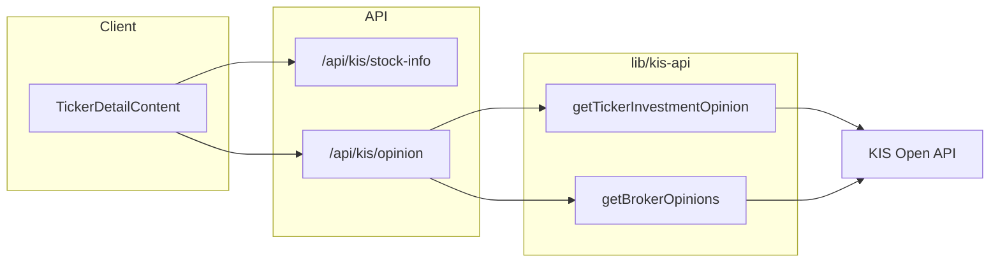

# KIS 종목투자의견·증권사별 투자의견 연동 계획

## 전제

- **TR ID 및 경로**: KIS 개발자센터 [국내주식] 종목정보(또는 시세분석) 카테고리에서 **"종목투자의견"**, **"증권사별 투자의견"** API의 TR ID·URL·요청/응답 스펙을 확인한 뒤 반영합니다. 포털 문서 없이 구현 시에는 placeholder TR ID와 경로를 두고, 문서 확인 후 수정하는 단계를 권장합니다.

---

## 1. 타입 정의 ([types/api.ts](types/api.ts))

- **종목투자의견** (한 종목에 대한 통합/대표 의견):  
`KisTickerOpinion` — KIS 응답에서 필요한 필드만 선별해 정의 (예: 의견코드, 의견명, 목표가, 전망 등. 실제 필드명은 API 문서 기준).
- **증권사별 투자의견** (증권사별 의견 목록):  
`KisBrokerOpinion` — 증권사명, 의견, 목표가, 제시일 등.  
`KisInvestmentOpinion` = `{ tickerOpinion: KisTickerOpinion | null; brokerOpinions: KisBrokerOpinion[] }` 형태로 통합 타입 정의.
- [TickerDetailInfo](types/api.ts)의 `investmentOpinion?: unknown`을 `investmentOpinion?: KisInvestmentOpinion | null`로 구체화.

---

## 2. KIS API 연동 ([lib/kis-api.ts](lib/kis-api.ts))

- **getTickerInvestmentOpinion(stockCode: string)**  
  - 국내주식 **종목투자의견** API 호출 (GET, 종목코드 6자리).  
  - TR ID·경로는 KIS 가이드 기준으로 설정 (예: 실전/모의 각각 문서 확인).  
  - 응답 파싱 후 `KisTickerOpinion` 형태로 반환, 실패 시 `null`.
- **getBrokerOpinions(stockCode: string)**  
  - 국내주식 **증권사별 투자의견** API 호출 (GET, 종목코드 6자리).  
  - 응답을 `KisBrokerOpinion[]`로 파싱, 실패 시 `[]`.
- 두 API 모두 기존과 동일하게 `getAccessToken()` 사용, 실전/모의 base URL·tr_id 구분 유지.
- **문서**: [docs/KIS_STOCK_INFO.md](docs/KIS_STOCK_INFO.md)에 위 두 API의 TR ID, 경로, 응답 필드 → 앱 필드 매핑 테이블을 추가(실제 스펙 확인 후 작성).

---

## 3. API Route

- **옵션 A — 기존 확장**: [app/api/kis/stock-info/route.ts](app/api/kis/stock-info/route.ts)에서 종목정보 조회 시 `getTickerInvestmentOpinion`, `getBrokerOpinions`를 함께 호출해 `TickerDetailInfo.investmentOpinion`에 넣어 반환.  
  - 장점: 클라이언트가 한 번만 호출.  
  - 단점: stock-info 응답이 무거워짐, 투자의견만 필요한 경우 비효율.
- **옵션 B — 별도 Route**: `GET /api/kis/opinion?code=005930` 신규 생성.  
  - 내부에서 `getTickerInvestmentOpinion(code)`, `getBrokerOpinions(code)` 호출 후 `KisInvestmentOpinion` JSON 반환.  
  - 종목 상세 페이지에서 stock-info와 병렬로 `useQuery`로 호출.  
  - 캐시: `Cache-Control` 또는 `unstable_cache`로 5~15분 정도 유지 (투자의견은 실시간성 낮음).

**권장**: 옵션 B. 종목 상세가 이미 stock-info·financials 등 여러 소스를 쓰고 있으므로, 투자의견만 별도 Route로 두고 클라이언트에서 병렬 요청하는 구성이 명확하고, 캐시·에러 분리도 쉽습니다.

---

## 4. 종목 상세 UI ([components/dashboard/TickerDetailContent.tsx](components/dashboard/TickerDetailContent.tsx))

- **데이터**: `GET /api/kis/opinion?code={code}` (옵션 B 시)를 `useQuery`로 호출. `enabled: !!code`, `staleTime` 10~15분.
- **섹션 추가**: "투자의견" 블록을 재무비율 또는 내 포트폴리오 근처에 배치.
  - **종목 투자의견**: 통합/대표 의견이 있으면 요약 카드 형태로 표시 (의견명, 목표가, 전망 등 — 필드는 API 스펙에 맞게).
  - **증권사별 투자의견**: 테이블 또는 카드 리스트 (증권사명, 의견, 목표가, 제시일 등). 데이터 없으면 "증권사별 투자의견이 없습니다" 등 메시지 표시.
- **참고 문구**: "투자 권유가 아닌 참고용 정보입니다" 등 PRD에 맞는 안내 문구 유지.
- **로딩·에러**: `isPending` 시 스켈레톤 또는 "로딩 중", `error` 시 "투자의견을 불러올 수 없습니다" 등 처리.

---

## 5. 데이터 흐름 (개념)

---

## 6. 작업 순서 요약

1. **KIS 포털 확인**: [국내주식] 종목정보(또는 시세분석)에서 "종목투자의견", "증권사별 투자의견" TR ID·URL·요청/응답 스펙 확인.
2. **타입**: [types/api.ts](types/api.ts)에 `KisTickerOpinion`, `KisBrokerOpinion`, `KisInvestmentOpinion` 정의 및 `TickerDetailInfo.investmentOpinion` 타입 지정.
3. **lib/kis-api.ts**: `getTickerInvestmentOpinion`, `getBrokerOpinions` 구현 (실제 TR ID·경로·파싱은 1번 스펙에 맞춤).
4. **API Route**: `app/api/kis/opinion/route.ts` 추가, `code` 쿼리로 두 함수 호출 후 JSON 반환, 캐시 헤더 또는 unstable_cache 적용.
5. **문서**: [docs/KIS_STOCK_INFO.md](docs/KIS_STOCK_INFO.md)에 위 두 API 행 및 필드 매핑 추가.
6. **UI**: TickerDetailContent에서 `/api/kis/opinion` useQuery 추가, "투자의견" 섹션(종목 의견 + 증권사별 의견) 렌더링 및 로딩·에러·없음 처리.

---

## 7. TR ID·경로 확인이 필요한 경우

구현 시점에 KIS 개발자센터 문서에서 해당 API를 찾을 수 없다면:

- [lib/kis-api.ts](lib/kis-api.ts)에는 **주석으로 "종목투자의견 / 증권사별 투자의견 — KIS 포털 [국내주식] 종목정보에서 TR ID·경로 확인 후 연동"**을 남기고,
- `getTickerInvestmentOpinion` / `getBrokerOpinions`는 **빈 구현(즉시 `null` / `[]` 반환)** 또는 **placeholder TR ID로 호출 후 4xx/5xx 시 null/[] 반환**으로 두고,
- [docs/KIS_STOCK_INFO.md](docs/KIS_STOCK_INFO.md)에 "연동 예정 — 포털에서 스펙 확인 필요"를 명시한 뒤, 나중에 스펙 확인 시 실제 TR ID·경로·파싱만 채우면 됩니다.

이 순서로 진행하면 KIS 가이드의 "국내주식 종목투자의견"·"국내주식 증권사별 투자의견" API를 활용해 종목당 더 다양한 참고 정보를 제공할 수 있습니다.