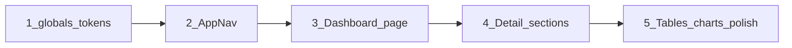

# UI/UX 미니멀·아이폰 컨셉 개선 계획

## 현재 구조 요약

- **대시보드** ([app/dashboard/page.tsx](app/dashboard/page.tsx)): `DashboardNav`(대시보드 | 종목별 분석 | 매매일지 | 전략별 성과) + 요약 카드 4개 + 종목별 분석 테이블 → 누적 수익금·포지션 집중도·손익 기여도 차트 → 전략별 성과 → 매매 내역.
- **상세 페이지** ([app/dashboard/ticker/[id]/page.tsx](app/dashboard/ticker/[id]/page.tsx)): 네비 없이 `TickerDetailContent`만 렌더. 상단에 "← 대시보드", "재무·시세 갱신" 후 다수 섹션(시세·가치평가·재무·비율·추정실적·매매동향·DART 차트·공시·투자의견·내 포트폴리오·보조지표·매매 일지).
- **스타일**: [app/globals.css](app/globals.css) + [tailwind.config.ts](tailwind.config.ts). shadcn 계열 CSS 변수(light/dark), `--color-profit`(빨강), `--color-loss`(파랑). Recharts 사용.

---

## 1. 디자인 방향 (아이폰·캘m·미니멀)

| 항목        | 방향                                                                                                                        |
| --------- | ------------------------------------------------------------------------------------------------------------------------- |
| **색상**    | 배경·카드·텍스트는 중성 그레이 톤(밝은 모드: 거의 흰 배경, 연한 카드). 강조는 최소한으로, 수익/손실만 의미 있는 색(수익: 부드러운 빨강, 손실: 부드러운 파랑) 유지. 차트는 2~3가지 캘m한 톤으로 통일. |
| **타이포**   | 제목·숫자 위계 명확: 섹션 제목은 한 단계만 굵게, 본문은 regular. 숫자(가격·비율)는 가독성 좋은 크기·weight.                                                   |
| **간격·카드** | 섹션 간 일관된 여백(예: 24px). 카드는 얇은 테두리 또는 미세한 그림자, 큰 border-radius(예: 12px)로 아이폰 느낌.                                            |
| **네비게이션** | 한 줄 상단 바 또는 하단 탭 하나로 통일. 대시보드·상세 모두 동일 네비 노출. 링크 수 최소(대시보드, 종목별 분석, 매매일지, 전략별 성과 + 상세에서는 “대시보드로” 등).                      |

---

## 2. 글로벌 네비게이션 (심플·미니멀)

- **위치**: 앱 전체 공통 — [app/layout.tsx](app/layout.tsx)에서 레이아웃에 넣거나, dashboard 레이아웃 + ticker 상세에서 공통 컴포넌트 사용.
- **구성**: 
  - 상단 단일 바: 로고/앱명(선택) + “대시보드” | “종목별 분석” | “매매일지” | “전략별 성과” (앵커 또는 경로). 텍스트만, 아이콘은 선택.
  - 상세 페이지에서도 동일 바 유지 + “← 대시보드” 또는 “종목 상세” 등 컨텍스트 하나.
- **스타일**: 배경은 `background`/`card` 톤, 구분선만 얇게. 활성/호버는 미세한 배경 변화 또는 언더라인만.
- **수정 파일**: [components/dashboard/DashboardNav.tsx](components/dashboard/DashboardNav.tsx) 확장 또는 `AppNav.tsx` 신규 → layout 또는 dashboard + ticker 공통에서 사용. [app/dashboard/page.tsx](app/dashboard/page.tsx)에서 기존 `DashboardNav` 대체, [app/dashboard/ticker/[id]/page.tsx](app/dashboard/ticker/[id]/page.tsx)에서 같은 네비 + 상세용 백링크만 추가.

---

## 3. 디자인 토큰·글로벌 스타일 (캘m·심플)

- **[app/globals.css](app/globals.css)**  
  - 배경: `--background` 밝은 회백(예: 0 0% 98%). 카드: `--card` 흰색에 가깝게.  
  - `--color-profit` / `--color-loss`: 채도 낮춰 캘m하게 (예: 수익 0~~10도 빨강, 손실 210~~220도 파랑).  
  - `--muted-foreground`로 보조 텍스트만 구분, 나머지는 단순화.  
  - `--radius`: 12px 수준으로 통일(카드·버튼).
- **다크 모드** (이미 `class` 기반): 같은 톤으로 어두운 배경·카드만 적용.
- **tailwind**: 기존 `profit`/`loss`/`chart` 유지하되, globals에서 정의한 값으로 일관 적용.

---

## 4. 대시보드 페이지 (핵심 유지·정리)

- **요약 카드** ([components/dashboard/SummaryCards.tsx](components/dashboard/SummaryCards.tsx)): 4개 유지. 카드 스타일만 통일(패딩·radius·테두리), 숫자 강조(크기·색상)만 살짝 강화.
- **섹션 제목**: `h1` 하나(페이지 제목), 나머지는 `h2`로 통일하고 시각적 위계만 주어 “한눈에” 스캔 가능하게.
- **테이블·차트**: 기존 구조 유지. 테이블은 헤더 배경·행 구분선만 캘m하게, 차트는 [tailwind chart 변수](tailwind.config.ts) 기반 2~3색으로 단순화.
- **수정**: [app/dashboard/page.tsx](app/dashboard/page.tsx) 마진/패딩 일관화, [components/dashboard/SummaryCards.tsx](components/dashboard/SummaryCards.tsx) 스타일만 조정. 필요 시 `CumulativePnlChart` 등 차트 색상만 CSS 변수에 맞춤.

---

## 5. 상세 페이지 (투자 정보 한눈에·표·차트·색상 조화)

목표: **표와 색상·도표를 조화**시켜 투자 판단에 필요한 정보를 **한눈에** 파악.

- **상단 블록 (고정)**  
  - 종목명·코드·현재가·전일대비(색상: 수익/손실). 보유 시 보유 수량·평가금액·평가손익 한 줄.  
  - “재무·시세 갱신” 버튼은 캘m한 보조 버튼 스타일(테두리 또는 muted 배경).
- **정보 그룹핑·시각 위계**  
  - **1) 시세·가치**  
    - 시세 요약(시고저·거래량·52주) + 가치평가(PER/PBR/EPS/BPS/Forward EPS)를 한 카드 또는 인접 카드 2개로 배치. 숫자는 라벨(작고 muted) + 값(강조).
  - **2) 재무·비율**  
    - 재무 요약(KIS) + 비율(재무/수익성/안정성/성장성/기타)을 그리드로. 표 형태 유지하되 헤더·구분선만 명확히, 배경은 통일.
  - **3) 차트 영역**  
    - DART 매출·영업이익·당기순이익 막대 차트 + 현금흐름 표: 같은 섹션에 차트 위·표 아래 또는 좌우(데스크톱)로 배치. 차트 색상은 `chart-1~~chart-3` 등 2~~3색만 사용해 단순화.
  - **4) 투자 참고**  
    - 추정실적 → 매매동향(테이블) → 투자의견 순. 테이블은 행 구분·헤더만 명확, “참고용” 문구는 작게.
  - **5) 내 포트폴리오·보조지표·매매 일지**  
    - 포트폴리오 숫자 카드형, 보조지표(RSI/MACD) 숫자+간단 라벨, 매매 일지는 테이블. 수익/손실 숫자만 `text-profit`/`text-loss` 적용.
- **표 스타일 통일**  
  - `thead`: `bg-muted/40`, `border-b`, 라벨만 작게.  
  - `tbody`: `border-b` 연한 선, 짝수 행 배경(선택) 또는 없이.  
  - 셀 패딩 일관(예: `p-3`).
- **색상 규칙**  
  - 수익: `text-profit`(또는 배경 연한 수익). 손실: `text-loss`.  
  - 차트: 동일 팔레트로 통일, 범례 간단히.
- **수정 파일**: [components/dashboard/TickerDetailContent.tsx](components/dashboard/TickerDetailContent.tsx).  
  - 섹션 순서·그룹핑만 위 1~5에 맞게 재배치(기존 컴포넌트/쿼리 유지).  
  - 클래스명만 정리: 카드 `rounded-xl border border-border/60`, 섹션 제목 `text-base font-semibold text-foreground`, 표 공통 클래스 추출 또는 wrapper 사용.

---

## 6. 구현 순서 제안

1. **globals.css + tailwind**
  배경·카드·profit/loss·radius·차트 변수 캘m하게 조정.
2. **글로벌 네비**
  `AppNav`(또는 `DashboardNav` 확장) 구현 후 layout/대시보드/상세에 공통 적용.
3. **대시보드**
  SummaryCards·섹션 제목·간격만 정리.
4. **상세 페이지**
  TickerDetailContent에서 섹션 순서·그룹핑(1~5) 적용.
5. **상세 표·차트 마무리**
  테이블 thead/tbody 스타일, 차트 색상·여백 통일.

---

## 7. 핵심 유지 사항 (요구사항 충족)

- **핵심 요소 유지**: 요약 카드, 종목별 분석, 누적 수익·포지션·손익 기여 차트, 전략별 성과, 매매 내역, 상세의 시세·재무·비율·투자의견·내 포트폴리오·보조지표·매매 일지·DART·공시 — 모두 유지.
- **네비게이션**: 심플·미니멀(한 줄, 최소 링크), 대시보드·상세 동일.
- **색상**: 캘m·심플·아이폰 느낌(중성 베이스 + 수익/손실만 의미 색).
- **상세 페이지**: 표·색상·도표 조화, 그룹핑과 위계로 한눈에 투자 정보 판단 가능하도록 구성.

이 순서대로 진행하면 “계획 수립 후 실행” 요청에 맞춰 단계별로 적용할 수 있습니다.