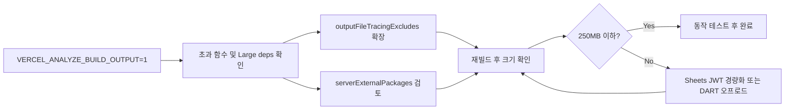

# Vercel 서버리스 함수 250MB 초과 해결 계획

## 배경

- **제한**: Vercel 서버리스 함수 unzipped 최대 250MB (약 50MB 압축). 초과 시 배포 실패.
- **현재 설정**: [next.config.mjs](e:/apps/my-stock/next.config.mjs)에 `serverExternalPackages: ["adm-zip"]`, `/api/`**용 `outputFileTracingExcludes`(문서·테스트·소스맵 등) 적용됨.
- **주요 의존성**: `google-auth-library`(Sheets 인증), `adm-zip`·`iconv-lite`(DART 전자공시), `fs`/`path` 사용(KIS API). `googleapis` 전패키지는 이미 제거된 상태.

## 1단계: 초과 함수 및 용량 원인 식별

- **환경 변수 설정**: Vercel 프로젝트(또는 로컬 `vercel build`)에 `**VERCEL_ANALYZE_BUILD_OUTPUT=1`** 설정 후 재배포.
- **빌드 로그 확인**: 로그에 함수별 unzipped 크기(MB)와 "Large dependencies" 목록이 출력됨. 어떤 **경로**(예: `/api/dart/financials`, `/api/sheets/...`)가 250MB를 넘는지, **어떤 파일/패키지**가 상위를 차지하는지 확인.
- **기대 결과**: 예) `google-auth-library` 하위, `adm-zip`, `iconv-lite`, 또는 특정 `node_modules` 경로가 상위에 노출되면 해당 구간을 2~3단계에서 집중 제거/경량화.

## 2단계: 트레이싱·외부 패키지로 번들 축소

- **outputFileTracingExcludes 확장**  
[next.config.mjs](e:/apps/my-stock/next.config.mjs)의 `outputFileTracingExcludes["/api/**"]`에 아래를 추가 검토:
  - `node_modules/google-auth-library/**/test/`**, `**/docs/`**, `**/*.md`, `**/README*`, `**/CHANGELOG*`
  - `node_modules/**/test/**`, `node_modules/**/tests/**` (이미 있으면 유지)
  - 필요 시 `**/node_modules/google-auth-library/build/**` 등 불필요한 빌드 산출물 제외(실행에 필요한 부분은 제외하지 않도록 주의)
- **serverExternalPackages 추가 검토**
  - `**google-auth-library`** 추가: 번들러가 패키지 전체를 번들하지 않고 Node `require`로 로드. 트레이서가 여전히 해당 패키지 파일을 복사하므로, **2단계에서 제외 패턴과 함께** 사용해야 효과가 있음.
  - `**iconv-lite`** 추가 검토: [lib/dart-fundamental.ts](e:/apps/my-stock/lib/dart-fundamental.ts)에서 이미 동적 `import("iconv-lite")` 사용 중. 서버 전용이면 `serverExternalPackages`에 넣어 번들 제외 가능.
- **주의**: `outputFileTracingExcludes`가 폴더 단위로 동작하지 않는 이슈가 있을 수 있음([next#54245](https://github.com/vercel/next.js/issues/54245)). 적용 후에도 크기가 줄지 않으면, 제외 패턴을 파일 단위로 조정하거나 공식 권장 방식 재확인.

## 3단계: 무거운 의존성 경량화 또는 오프로드

- **Google Sheets 인증 경량화 (우선 검토)**  
[lib/google-sheets.ts](e:/apps/my-stock/lib/google-sheets.ts)는 현재 `google-auth-library`의 **JWT**만 사용해 서비스 계정 액세스 토큰을 발급하고, 나머지는 `fetch`로 Sheets API 호출.
  - **옵션 A**: **최소 JWT 구현**으로 전환. 서비스 계정 JSON으로 JWT 서명 후 Google OAuth2 token 엔드포인트에 토큰 교환만 구현. `jose` 또는 `jsonwebtoken` + `crypto` 등 경량 라이브러리로 대체하면 `google-auth-library` 제거 가능(용량 감소 효과 큼).
  - **옵션 B**: 2단계만으로 250MB 이하가 되면 추가 변경 없이 유지.
- **DART(adm-zip, iconv-lite)**  
  - [lib/dart-api.ts](e:/apps/my-stock/lib/dart-api.ts), [lib/dart-fundamental.ts](e:/apps/my-stock/lib/dart-fundamental.ts)에서 이미 **동적 import** 사용. `adm-zip`은 `serverExternalPackages`에 있음.
  - 2단계에서 `iconv-lite`를 `serverExternalPackages`에 넣고, `outputFileTracingExcludes`로 해당 패키지 내 문서/테스트 제거.
  - 여전히 초과 시: DART 연동만 수행하는 **별도 경량 API 서비스(또는 별 배포)**로 분리하고, 메인 앱은 해당 API를 호출하는 방식으로 오프로드 검토(가이드: "Code-split large functions", "Offload intensive processes").
- **기타**
  - 사용하지 않는 의존성 제거, `npm dedupe` 실행, 정적 에셋/대용량 JSON이 API 번들에 포함되지 않았는지 확인.

## 4단계: 검증 및 재발 배포

- `vercel build`(또는 Vercel 연결 저장소 푸시) 후 빌드 로그에서 **모든 서버리스 함수가 250MB 미만**인지 확인.
- Sheets·DART·KIS 관련 API 엔드포인트를 실제로 호출해 동작 검증(인증, ZIP/XML 파싱, 인코딩 등).

## 요약 플로우

## 참고

- [Vercel: Serverless Function 250MB 한도 트러블슈팅](https://vercel.com/guides/troubleshooting-function-250mb-limit)
- [Next.js: outputFileTracingExcludes / output](https://nextjs.org/docs/app/api-reference/config/next-config-js/output)
- [Next.js: serverExternalPackages](https://nextjs.org/docs/app/api-reference/next-config-js/serverExternalPackages)

