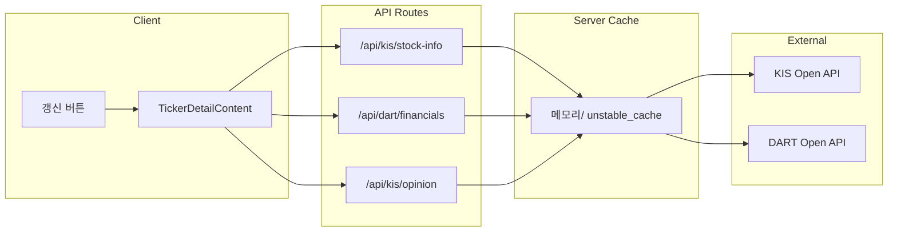

# 가치투자 재무·투자의견 전면 강화 계획

## 1. 목표 및 원칙

- **목표**: "현재가와 미래가치", "주식이 싼지 비싼지"를 판단할 수 있도록 **대차대조표·손익계산서·재무비율·수익성/안정성/성장성/기타 비율·투자의견**을 한 화면에 제공.
- **데이터 소스**: **KIS Open API**(시세·투자의견) + **DART 전자공시 Open API**(재무제표·재무비율). 둘 다 무료·공개 API이며, DART는 [opendart.fss.or.kr](https://opendart.fss.or.kr) 인증키 발급 필요.
- **캐시**: 재무·비율·투자의견은 실시간 변동이 아니므로 **서버 메모리 캐시**(또는 Next.js `unstable_cache`)로 보관하고, **최초 접속 시 로드·필요 시 "갱신" 버튼으로 재조회**.

---

## 2. 데이터 소스 및 API 설계

### 2.1 DART 전자공시 API (재무제표·비율)

| 용도 | DART API | 비고 |
|------|----------|------|
| 종목코드(6자리) → corp_code(8자리) | 회사목록 다운로드 (corpCode.xml 또는 공개 API) | 매핑 테이블 캐시, 주기적 갱신 |
| 대차대조표·손익계산서·현금흐름표 | 정기보고서 재무정보 / 단일회사 주요계정 | 사업연도·보고서 구분 |
| 재무비율(수익성·안정성·성장성 등) | 단일회사 주요 재무지표 API 또는 재무제표 수치로 앱에서 계산 | PER/PBR/ROE/부채비율/유동비율/매출증가율 등 |

- **환경 변수**: `DART_API_KEY` (opendart.fss.or.kr 인증키).
- **캐시**: 종목·사업연도별 재무/비율은 TTL 24시간 또는 수동 갱신. corp_code 목록은 1일 1회 등.

### 2.2 KIS Open API (시세·투자의견)

- **시세**: 기존 [lib/kis-api.ts](lib/kis-api.ts) `getPriceInfo`, `getDailyChart` 유지.
- **투자의견**: KIS 개발자센터 "[국내주식] 종목정보" 또는 "시세분석" 카테고리에서 **종목투자의견**, **증권사별 투자의견** TR ID·경로 확인 후 연동. 문서에 없으면 Phase 2로 미루고, 가능한 TR만 먼저 연동.

### 2.3 데이터 흐름 (개념)

---

## 3. 구현 단계

### Phase 1 — DART 연동 기반

- **환경 변수**: `.env.example` 및 문서에 `DART_API_KEY` 추가.
- **lib/dart-api.ts** (신규):  
  - DART base URL, 인증키 헤더.  
  - `getCorpCodeByStockCode(stockCode: string)`: corp_code 목록 조회·캐시 후 6자리 종목코드 → corp_code(8자리) 반환. (DART 회사목록 API 또는 corpCode.xml 파싱.)  
  - `getFinancialStatements(corpCode: string, year: string)`: 대차대조표·손익계산서(및 필요 시 현금흐름표) 요청·파싱.  
  - `getKeyFinancialRatios(corpCode: string, year: string)` 또는 재무제표 수치로 **수익성(ROE, ROA, 매출순이익률 등)·안정성(부채비율, 유동비율 등)·성장성(매출·이익 증가율 등)·기타(PER, PBR 등)** 계산. (DART에 "주요 재무지표" API가 있으면 사용, 없으면 재무제표 항목으로 계산.)
- **app/api/dart/financials/route.ts** (신규):  
  - Query: `code`(6자리 종목코드).  
  - 내부: 종목코드 → corp_code 변환, 재무제표·비율 조회.  
  - 응답: `{ balanceSheet, incomeStatement, ratios }` 형태.  
  - 캐시: `unstable_cache` 또는 인메모리 Map + TTL(예: 3600초), `revalidate` 쿼리 있으면 캐시 스킵.

### Phase 2 — 타입·응답 형식

- **types/api.ts**:  
  - `DartBalanceSheet`, `DartIncomeStatement` (필드는 DART 응답 기준으로 필요한 항목만).  
  - `FinancialRatios`: 수익성(roe, roa, operatingMargin, netProfitMargin 등), 안정성(debtRatio, currentRatio 등), 성장성(revenueGrowth, netIncomeGrowth 등), 기타(per, pbr 등).  
  - `TickerDetailInfo` 확장: `financials?: { balanceSheet, incomeStatement, ratios }`, `investmentOpinion?: { ... }` (KIS 연동 시).

### Phase 3 — KIS 투자의견 연동

- KIS 포털 API 가이드에서 **국내주식 종목투자의견**, **증권사별 투자의견** TR/경로 확인.  
- 있으면 [lib/kis-api.ts](lib/kis-api.ts)에 `getTickerOpinion(code)`, `getBrokerOpinions(code)` 추가, [app/api/kis/stock-info/route.ts](app/api/kis/stock-info/route.ts)에 포함하거나 별도 `/api/kis/opinion` 생성.  
- 없으면 스킵하고 문서에 "추후 KIS 포털 확인" 명시.

### Phase 4 — 종목 상세 UI 전면 재구성

- **[components/dashboard/TickerDetailContent.tsx](components/dashboard/TickerDetailContent.tsx)**  
  - 기존 "시세·가치 지표"를 **시세 요약** 카드로 유지(현재가, 전일대비, 52주 고/저).  
  - 신규 섹션 (아래 순서 권장):  
    1. **대차대조표**: 주요 항목(자산총계, 부채총계, 자본총계, 유동자산, 비유동자산 등) 테이블/카드.  
    2. **손익계산서**: 매출액, 영업이익, 당기순이익 등.  
    3. **재무비율**:  
       - 수익성 비율 (ROE, ROA, 매출순이익률 등)  
       - 안정성 비율 (부채비율, 유동비율 등)  
       - 성장성 비율 (매출·이익 증가율 등)  
       - 기타 주요 비율 (PER, PBR 등, KIS/DART 중 가용한 쪽)  
    4. **투자의견**: 종목 투자의견, 증권사별 투자의견 (KIS 연동 시).  
  - **갱신 버튼**: 재무/비율/투자의견 쿼리에 `queryKey`에 타임스탬프 또는 `invalidateQueries`로 "갱신" 시 재요청.  
- 데이터 로딩: `useQuery`로 `/api/kis/stock-info`, `/api/dart/financials`, (있으면) `/api/kis/opinion` 병렬 호출. `staleTime` 길게(예: 30분~1시간), 갱신 버튼 시 `refetch`.

### Phase 5 — 캐시·갱신 정책

- **서버**:  
  - DART 재무/비율: `unstable_cache(..., { revalidate: 3600 })` 또는 모듈 레벨 Map + TTL.  
  - 쿼리 파라미터 `revalidate=1`이면 캐시 무시하고 DART/KIS 재호출.  
- **클라이언트**:  
  - React Query `staleTime` 30분 등으로 설정.  
  - "갱신" 버튼: 해당 쿼리들 `refetch()` 또는 `invalidateQueries` 후 refetch.  
- **문서**: [docs/ARCHITECTURE.md](docs/ARCHITECTURE.md)에 DART 연동·캐시 정책, [docs/KIS_STOCK_INFO.md](docs/KIS_STOCK_INFO.md)에 투자의견 TR(연동 시) 반영.

---

## 4. 사용자 측 준비 사항

- **DART 인증키**: [opendart.fss.or.kr](https://opendart.fss.or.kr) 회원가입 후 인증키 신청. 발급받은 키를 Vercel·로컬 환경 변수 `DART_API_KEY`에 설정.
- **KIS 투자의견**: KIS 개발자센터에서 해당 API 존재 여부 확인 후, 있으면 앱키/앱시크릿으로 동일하게 호출.

---

## 5. 요약

| 항목 | 내용 |
|------|------|
| 재무제표·비율 | DART Open API (대차대조표, 손익계산서, 재무비율·수익성/안정성/성장성/기타) |
| 시세·52주 | 기존 KIS stock-info 유지 |
| 투자의견 | KIS [국내주식] 종목정보/시세분석 문서 확인 후 연동 |
| 캐시 | 서버 unstable_cache 또는 인메모리 + TTL, 클라이언트 staleTime, 갱신 버튼으로 재조회 |
| UI | 종목 상세: 시세 요약 → 대차대조표 → 손익계산서 → 재무비율 → 투자의견 순으로 재구성 |

이 계획대로 Phase 1부터 순차 구현하면, 가치투자 관점의 "현재가·미래가치·싼지 비싼지" 판단에 필요한 정보를 한 곳에서 확인하고, 필요 시 갱신할 수 있는 구조가 됩니다.
