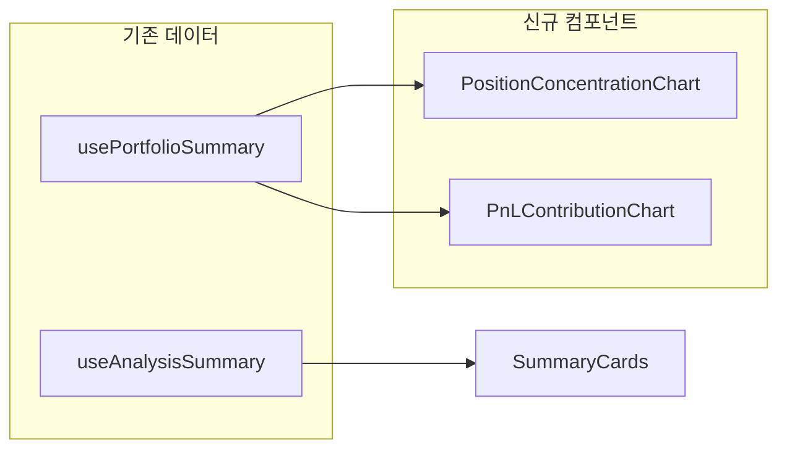

# 대시보드 지표 전면 개편 계획

## 현재 구조와 한계

- **종목별 실현 수익률**: 매도한 종목의 과거 실현수익률(%) 막대 차트. “어디서 과거에 수익/손실 냈는지”만 보여주며, **지금 포지션을 늘릴지/줄일지** 판단에는 직접 연결되기 어렵다.
- **승률 (승/패)**: 매도 건 수 기준 승/패 비율 파이 차트. 단일 숫자에 가깝고, **다음 매매 전략(손절/익절 기준, 포지션 크기)** 에 대한 인사이트로 이어지기 힘들다.

즉, 두 지표 모두 **과거 결과 요약**에 치우쳐 있고, “지금 무엇을 할지”에 대한 **행동 유도**가 약하다.

---

## 개편 방향: “최고의 투자 파트너” 관점

투자에 도움이 되려면 다음 질문에 답할 수 있어야 한다.

| 질문                      | 필요한 지표                      |
| ----------------------- | --------------------------- |
| 한 종목에 과도하게 올인했는가?       | **포지션 집중도** (종목별 평가금액 비중)   |
| 지금 수익/손실은 어디서 나는가?      | **손익 기여도** (보유 종목별 평가손익 금액) |
| 실현된 수익 vs 아직 잠긴 수익·손실은? | **실현 vs 미실현** 요약            |
| 손절·재평가 후보는?             | **손실 포지션** 요약               |

이 네 가지를 전제로, 기존 두 차트 영역을 아래처럼 교체하는 것을 제안한다.

---

## 제안: 교체할 2개 섹션

### 1) 포지션 집중도 (Concentration)

- **의미**: 보유 종목별 **평가금액이 총 자산에서 차지하는 비중(%)**.
- **투자 활용**: 특정 종목 비중이 지나치게 크면 리스크 집중 → 분산/감량 검토; 소액만 있는 종목은 정리 후보.
- **데이터**: 기존 [usePortfolioSummary](hooks/usePortfolioSummary.ts) — `positions[].marketValue`, `totalMarketValue`.
- **UI**: 보유 종목(quantity > 0)만 사용, 상위 N개(예: 10개) 막대 또는 도넛 차트. “기타”로 나머지 합산 가능.
- **구현**: 신규 컴포넌트 `PositionConcentrationChart.tsx`, API 추가 없음.

### 2) 손익 기여도 + 손실 포지션 요약

- **손익 기여도**
  - **의미**: 보유 종목별 **평가손익(금액)** — “지금 청산하면 어디서 이익/손실이 나는지”.
  - **투자 활용**: 수익이 큰 종목(익절 검토), 손실이 큰 종목(손절/재평가 검토).
  - **데이터**: `positions[].profitLoss`, `positions[].ticker`.
  - **UI**: 가로 막대 차트(금액, 종목명). 수익/손실 색 구분(한국 시장 컨벤션 유지).
- **손실 포지션 요약**
  - **의미**: **평가손익 < 0** 인 보유 종목만 정리한 리스트(또는 상위 N개).
  - **투자 활용**: 손절·재평가·매매일지 복기 대상 한눈에 파악.
  - **데이터**: `positions.filter(p => p.profitLoss < 0)`.
  - **UI**: 같은 카드 안에 작은 테이블 또는 리스트(종목명, 평가손익, 평가수익률, 상세 링크).
- **구현**: 신규 `PnLContributionChart.tsx`(또는 `ProfitLossByPosition.tsx`) 하나에 “손익 기여도 차트 + 손실 포지션 요약” 모두 포함. API 추가 없음.

---

## 선택: “실현 vs 미실현” 배치

- **실현손익**: 이미 [SummaryCards](components/dashboard/SummaryCards.tsx)에 “총 실현손익”으로 있음.
- **미실현(평가손익)**: “현재 평가손익”으로 있음.
- **제안**: 별도 큰 차트보다는, 상단 카드 영역에 **“실현손익 vs 평가손익”** 비중을 한 줄 요약(예: 텍스트 + 미니 프로그레스)으로 두거나, 기존 카드 문구를 “실현 / 미실현”으로 명확히만 정리. 신규 전용 차트는 우선 제외해도 됨.

---

## 데이터 흐름 (기존 유지)

- **신규 API 없음.** [lib/analysis.ts](lib/analysis.ts), [app/api/analysis/summary/route.ts](app/api/analysis/summary/route.ts), [app/api/kis/portfolio-summary/route.ts](app/api/kis/portfolio-summary/route.ts) 변경 없이 진행 가능.
- **타입**: [types/api.ts](types/api.ts)의 `PortfolioSummaryResponse`, `positions` 구조 그대로 사용.

---

## 레이아웃 변경 ([app/dashboard/page.tsx](app/dashboard/page.tsx))

- **삭제**: `RealizedRateByTickerChart`, `WinRateChart` import 및 해당 섹션 전체.
- **추가**:
  - 섹션 1: **포지션 집중도** (`PositionConcentrationChart`).
  - 섹션 2: **손익 기여도 + 손실 포지션** (`PnLContributionChart` 또는 동일 역할의 단일 컴포넌트).
- **배치**: 기존 “누적 수익금 추이” 아래, 동일하게 2열 그리드(1: 포지션 집중도, 2: 손익 기여도·손실 포지션) 또는 1열 2행으로 배치.

---

## 삭제·보관 정책

- **RealizedRateByTickerChart.tsx**, **WinRateChart.tsx**: 대시보드에서 제거 후 **파일 삭제** 권장. PRD §3.4 “종목별 실현 수익률, 매수/매도 비중 및 승률” 문구는 “포지션 집중도, 손익 기여도, 손실 포지션 요약” 등으로 문서만 수정.
- 승률 수치는 **SummaryCards** “전체 승률”에 그대로 두어도 됨(참고용). 전면 개편 후 사용자 반응을 보고 카드에서도 제거/대체 검토 가능.

---

## 작업 순서 요약

1. **PositionConcentrationChart** 구현 — `usePortfolioSummary`로 보유 종목만 필터, `marketValue`/`totalMarketValue`로 비중 계산, Recharts 막대 또는 파이.
2. **PnLContributionChart**(또는 ProfitLossByPosition) 구현 — `positions`로 손익 기여도 막대 + `profitLoss < 0` 필터로 손실 포지션 테이블.
3. **dashboard/page.tsx** 수정 — 기존 두 차트 섹션 제거, 위 두 컴포넌트로 교체.
4. **RealizedRateByTickerChart.tsx**, **WinRateChart.tsx** 삭제.
5. (선택) **PRD.md** §3.4 차트 설명을 새 지표 기준으로 간단 수정.
6. (선택) **SummaryCards** 라벨을 “실현손익 / 평가손익(미실현)” 등으로 명확화.

이렇게 하면 “종목별 실현 수익률”·“승률(승/패)” 없이, **포지션 리스크·손익 구조·손실 후보**를 한눈에 보는 대시보드로 전환할 수 있다.