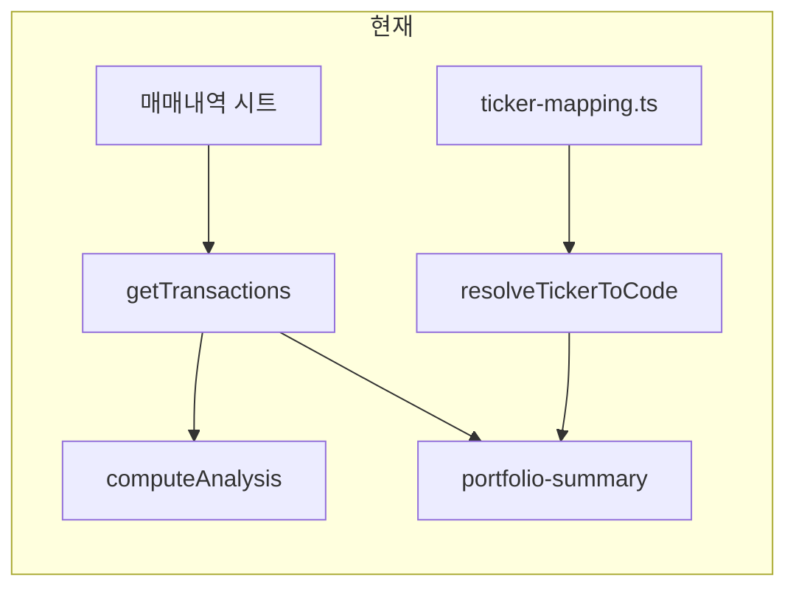
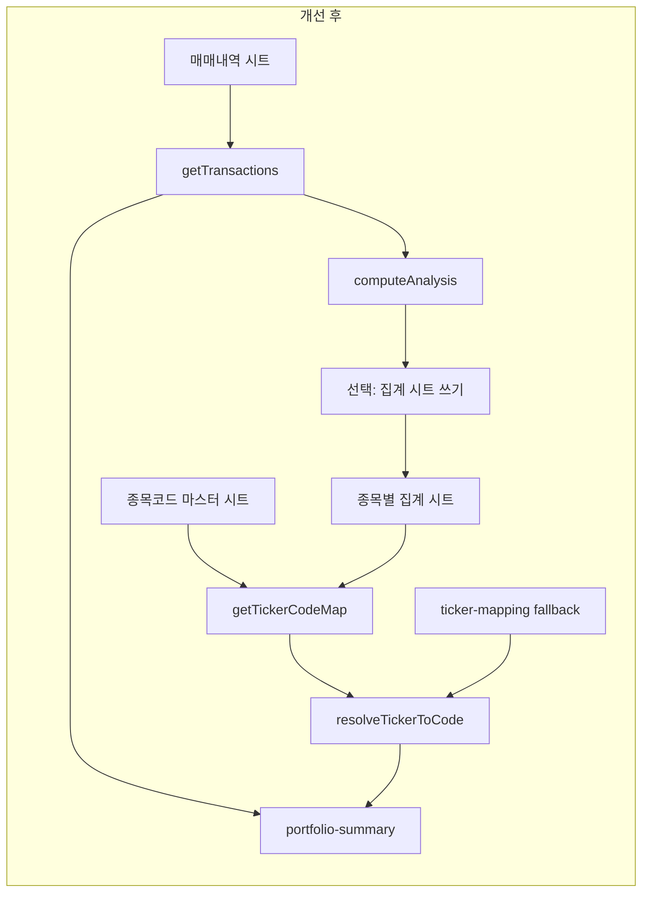

# 종목코드 마스터 시트 + 종목별 집계 시트 검토

## 현재 구조

- **매매 내역**: 단일 시트(`GOOGLE_SHEET_NAME`, 기본 "Sheet1")에서만 읽기/추가. [lib/google-sheets.ts](lib/google-sheets.ts)의 `getTransactions()`가 전체 시트 범위로 조회.
- **종목코드**: [lib/ticker-mapping.ts](lib/ticker-mapping.ts)에 하드코딩(삼성전자, LG전자만). [lib/portfolio-summary.ts](lib/portfolio-summary.ts)의 `resolveTickerToCode()`에서 6자리/접두사 추출 후 `tickerToCode()` 호출.
- **종목별 집계**: 시트 없음. [lib/analysis.ts](lib/analysis.ts)의 `computeAnalysis()`가 매매 내역을 메모리에서 집계해 API로 반환하고, [TickerAnalysisTable](components/dashboard/TickerAnalysisTable.tsx)이 표시.

---

## 제안: 시트 2종 + Fallback

### 1) 종목코드 마스터 시트 (신규 탭)

| 목적      | 사용자가 시트에서 종목명 ↔ 6자리 종목코드를 직접 관리. 앱은 이 시트를 읽어 KIS 현재가 조회 시 사용.                                                                |
| ------- | ---------------------------------------------------------------------------------------------------------------------------- |
| 시트 이름   | 환경 변수 `GOOGLE_SHEET_TICKER_MASTER` (예: `"종목코드"`). 미설정 시 이 시트는 사용하지 않음.                                                       |
| 헤더/컬럼   | 1행 헤더, 2행부터 데이터. 예: **Ticker**(종목명 또는 코드), **Code**(6자리 종목코드). Ticker가 한글/영문이면 Code로 KIS 조회.                                 |
| 읽기      | `lib/google-sheets.ts`에 `getTickerMaster(): Promise<{ ticker: string; code: string }[]>` 추가. 범위 `'${sheetName}'!A:B` 등으로 조회. |
| 매핑 우선순위 | `resolveTickerToCode()`에서 **(1) 이미 6자리/접두사** → **(2) 마스터 시트 조회** → **(3) 기존 ticker-mapping.ts** 순으로 적용.                      |

### 2) 종목별 집계 시트 (신규 탭)

| 목적                | 종목별 집계 결과를 시트에 두어, 시트에서 확인·편집 가능하게 함. 필요 시 이 시트의 Code 컬럼으로 종목코드 fallback 제공.                                                                                                                      |
| ----------------- | ------------------------------------------------------------------------------------------------------------------------------------------------------------------------------------------------- |
| 시트 이름             | 환경 변수 `GOOGLE_SHEET_AGGREGATION` (예: `"종목별집계"`). 미설정 시 집계는 기존처럼 메모리만 사용.                                                                                                                          |
| 컬럼 제안             | **Ticker**, **Code**(선택, 6자리), **매수횟수**, **매도횟수**, **총매수금액**, **총매도금액**, **실현손익**, **보유수량** 등. Code가 있으면 종목코드 마스터가 없을 때 여기서 사용.                                                                   |
| 동작 방식 (택 1 또는 병행) | **A) 앱이 쓰기**: 매매내역 조회 → `computeAnalysis()` + 보유수량 등 계산 → 이 시트 범위를 **덮어쓰기**(또는 append 후 정리). **B) 사용자 참고용**: 앱은 기존처럼 메모리 집계만 하고, 이 시트는 사용자가 수동으로 작성·종목코드 입력. 앱은 이 시트를 **읽기만** 해서 Code 컬럼으로 매핑 보강. |

### 3) Fallback: “종목코드를 가져오기 어려우면 종목별 집계 시트에서 관리”

- **종목코드 마스터**를 쓰지 않거나(env 미설정), 마스터에 해당 종목이 없을 때:
  - **종목별 집계 시트**가 있고 **Code** 컬럼에 값이 있으면, 그 시트를 **종목코드 소스**로 사용.
- 구현: `getTickerCodeMap()` 같은 단일 진입점에서 (1) 마스터 시트 → (2) 종목별 집계 시트(Code 컬럼) → (3) `ticker-mapping.ts` 순으로 조회. [lib/portfolio-summary.ts](lib/portfolio-summary.ts)의 `resolveTickerToCode()`는 이 맵을 사용하도록 변경.

---

## 구현 시 변경/추가 포인트

| 구분                           | 내용                                                                                                                                                                                       |
| ---------------------------- | ---------------------------------------------------------------------------------------------------------------------------------------------------------------------------------------- |
| **환경 변수**                    | `.env.example`에 `GOOGLE_SHEET_TICKER_MASTER`, `GOOGLE_SHEET_AGGREGATION` 예시 추가. 같은 스프레드시트 내 **다른 탭 이름**으로 지정.                                                                            |
| **lib/google-sheets.ts**     | `getTickerMaster()` 추가(마스터 시트 A:B 읽기). 선택: `getTickerAggregation()`(종목별 집계 시트 읽기), `writeTickerAggregation(rows)`(집계 결과 쓰기, A:I 등 범위 업데이트).                                              |
| **types/sheet.ts**           | 마스터 행 타입 `TickerMasterRow`, 종목별 집계 행 타입 `TickerAggregationRow`(Ticker, Code?, 매수횟수, 매도횟수, …) 정의.                                                                                         |
| **lib/ticker-mapping.ts**    | 시트 기반 매핑을 쓰도록 변경: 비동기 `getTickerCodeMap()`(또는 sync 캐시 채우기)에서 마스터/집계 시트 우선 조회, 없으면 기존 `TICKER_TO_CODE` 사용. `tickerToCode(ticker)`는 이 맵을 참조하거나, 호출부를 `resolveTickerToCode()`로 통일.          |
| **lib/portfolio-summary.ts** | `resolveTickerToCode()`가 시트 기반 맵을 사용하도록 수정. `enrichPortfolioSummaryWithKis()`는 비동기이므로 여기서 `getTickerCodeMap()`을 await 한 뒤 사용 가능.                                                         |
| **API**                      | 필요 시 `GET /api/sheets/ticker-master`, `GET /api/sheets/aggregation` 노출(캐시·권한 정책에 따라). 기존 분석/포트폴리오 API는 내부에서만 시트 읽으면 되므로 경로 추가는 선택.                                                       |
| **문서**                       | [docs/PRD.md](docs/PRD.md) §4 Data Model 또는 별도 §에 “종목코드 마스터 시트”, “종목별 집계 시트” 컬럼 정의. [docs/ARCHITECTURE.md](docs/ARCHITECTURE.md) §3 데이터 흐름·§6 ticker-mapping에 시트 우선 조회 및 fallback 순서 반영. |

---

## 정리

- **종목코드 마스터 시트**: 별도 탭으로 두고, Ticker/Code만 관리. 앱은 이 시트를 읽어 종목코드 1차 소스로 사용.
- **종목별 집계 시트**: 종목별 집계를 시트에 두고, 필요 시 **Code** 컬럼으로 종목코드를 마스터 대신 사용(fallback). 집계는 (A) 앱이 매매내역 기반으로 계산해 시트에 쓰거나, (B) 사용자가 시트에서 직접 관리하고 앱은 읽기만 하거나, 둘을 조합할 수 있음.
- **종목코드를 가져오기 어려운 경우**: 마스터 미설정 또는 해당 종목 없음 → **종목별 집계 시트**의 Code 컬럼 사용 → 그래도 없으면 기존 `ticker-mapping.ts` 순으로 적용하면 됨.

이 순서로 구현하면 “보유수량이 있는 종목만 현재가 조회” 등 기존 동작은 유지하면서, 종목코드와 종목별 집계를 시트로 확장할 수 있습니다.