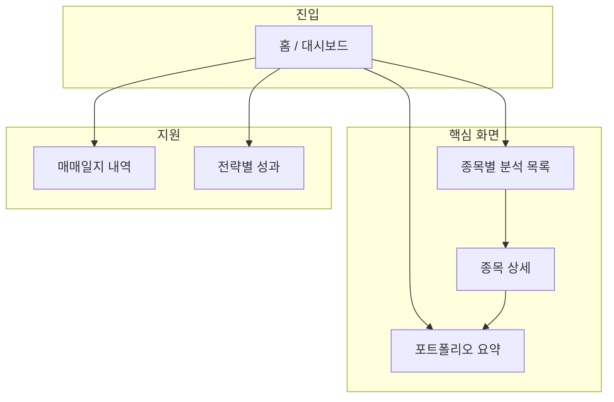

# 국내주식 투자 지원 앱 전면 개편 계획

## 1. 비전 및 포지셔닝 변경

| 구분        | 현재            | 개편 후                                    |
| --------- | ------------- | --------------------------------------- |
| **포지셔닝**  | 주식 매매일지 대시보드  | **최고의 투자 지원 애플리케이션** (가치투자 관점 매매 가이드)   |
| **핵심 가치** | 매매 기록·수익률 시각화 | **종목별 정보 수집 + 한눈에 확인 + 매수/매도 판단 지원**    |
| **대상**    | 매매 복기·수익률 관리  | 보유/관심 종목의 **종목정보·투자 참고 지표**를 모아 의사결정 지원 |

- 기존 기능(Google Sheets 매매일지, KIS 평가손익, 실현/승률)은 유지하되, **종목 단위 분석**을 앱의 중심으로 올립니다.
- 데이터 소스: **KIS Open API만 확장** — [국내주식] 종목정보·시세분석 등 공식 문서 기준으로 제공되는 API만 연동합니다.

---

## 2. 정보 구조(IA) 및 화면 구성

### 2.1 페이지/섹션 구조

- **홈(대시보드)**: 포트폴리오 요약 카드 + **종목별 분석 요약(핵심)** + 빠른 링크(종목 상세, 매매일지).
- **종목별 분석 목록**: 보유·거래 이력이 있는 종목을 **평가금액/실현손익 등 정렬**하여 리스트. 각 행에서 **한 줄 요약 지표**(현재가, PER/PBR 등 KIS 제공분, 내 보유 손익) + **매수/매도 참고 뱃지** 링크.
- **종목 상세(신규)**: 한 종목에 대한 **모든 정보를 한 화면에 수집·표시**. KIS 종목정보·시세분석, 내 보유·매매 이력, 실현/미실현 손익, 가치투자 관점 요약 카드(지표 해석·의견 요약). 매수/매도 판단에 필요한 요소만 깔끔하게 배치.
- **매매일지·전략별 성과**: 기존 TransactionTable, TagSummaryTable 유지하되 상단 네비게이션에서 "보조" 메뉴로 배치.

### 2.2 종목 상세 화면 설계(핵심)

- **상단**: 종목명, 종목코드, 현재가, 전일대비, 내 보유 수량·평가금액·평가손익 요약.
- **블록 1 — 시세·가치 지표**: KIS [국내주식] 종목정보·시세분석 API에서 제공하는 항목만 표시 (예: PER, PBR, EPS, 시가총액, 52주 high/low 등 — API 스펙 확인 후 매핑).
- **블록 2 — 내 포트폴리오**: 해당 종목 매수/매도 이력 요약, 평균 단가, 실현손익, 보유 수량, 평가손익.
- **블록 3 — 매매 가이드(가치투자 관점)**: 위 지표를 조합한 **참고용 요약 문구/뱃지** (예: "PER 구간", "보유 대비 수익률", "52주 대비 위치"). 투자 권유가 아닌 **참고 정보**로만 표시.
- **하단 또는 접이식**: 최근 매매 일지 스니펫(기존 시트 데이터).

---

## 3. 데이터 전략

### 3.1 기존 유지

- Google Sheets: 매매 내역, 종목코드 마스터, 종목별 집계(선택).
- KIS: 접근 토큰, **현재가(inquire-price)** — 기존 [lib/kis-api.ts](lib/kis-api.ts) 유지.

### 3.2 KIS API 확장(신규)

- **연동 대상**: KIS 개발자센터 [국내주식] **종목정보**, [국내주식] **시세분석** 카테고리 API.
- **구현 위치**: [lib/kis-api.ts](lib/kis-api.ts)에 함수 추가. API Route는 `/api/kis/` 하위에 신규 추가(예: `/api/kis/stock-info/route.ts`, `/api/kis/stock-analysis/route.ts` 또는 KIS 문서의 TR ID별 1:1).
- **캐시**: 종목정보·시세분석은 변동이 잦지 않으므로 Next.js cache 또는 short TTL(예: 5~15분) 적용해 호출 횟수 절감.
- **에러/미제공**: KIS에서 특정 항목을 제공하지 않으면 해당 필드는 "—" 또는 숨김 처리. 클라이언트는 필드 유무에 따라 UI 블록 표시/비표시.

### 3.3 타입·API 응답

- [types/api.ts](types/api.ts): 종목 상세용 타입 추가 (예: `TickerDetailInfo`, `TickerMarketStats`). KIS 응답 필드와 1:1 매핑하지 말고, **앱에서 사용할 필드만** 정의해 두고 매핑 레이어에서 채움.
- 종목 목록은 기존 `useAnalysisSummary` + `usePortfolioSummary`로 보유·거래 종목 집합을 만들고, 종목 상세는 **종목코드(또는 ticker)** 기준으로 KIS 종목정보/시세분석 API를 호출하는 구조로 통일.

---

## 4. UI/UX 개편 원칙

- **종목 중심**: 첫 화면에서 "어떤 종목을 볼지" 선택 → 해당 종목의 **모든 참고 정보**를 한 페이지에서 확인할 수 있게 구성.
- **매수/매도 판단 지원**: 종목 상세와 목록에서 "현재가·평가손익·가치 지표·52주 대비" 등을 **한눈에** 보이게 하고, 해석은 사용자 몫이 되도록 **깔끔한 숫자·뱃지·짧은 문구** 위주로 제공.
- **일관된 디자인**: [PRD §5](docs/PRD.md) 유지 — shadcn/ui, Tailwind, 반응형, 한국 주식 색상(수익/손실). 카드·테이블·뱃지 스타일을 통일하고, 정보 밀도는 높이되 시각적 계층(헤딩, 여백, 구분선)으로 가독성 확보.
- **네비게이션**: 상단 또는 사이드에 **대시보드 | 종목별 분석 | 매매일지 | 전략별 성과** 등으로 구분해, "종목별 분석"이 진입 포인트가 되도록 배치.

---

## 5. 문서 및 단계 정리

### 5.1 수정·작성할 문서

- **PRD 업데이트**: §1 프로젝트 개요를 "투자 지원 애플리케이션"으로, §3에 "종목별 분석(종목정보·가치 지표·매매 가이드)" 추가. §4 데이터 모델은 유지, KIS 확장 API 설명 보강.
- **ARCHITECTURE**: 데이터 흐름에 "KIS 종목정보/시세분석 → API Route → 종목 상세/목록" 추가, 새 API Route·캐시 정책 명시.
- **신규 문서(선택)**: `docs/KIS_STOCK_INFO.md` — 연동한 KIS API 목록, TR ID, 응답 필드 → 앱 필드 매핑 테이블.

### 5.2 구현 단계 제안

1. **Phase 1 — KIS 연동**: KIS 개발자센터 문서로 [국내주식] 종목정보·시세분석 API 스펙 확인 → [lib/kis-api.ts](lib/kis-api.ts) 및 API Route 추가 → 타입·캐시 적용.
2. **Phase 2 — 종목 상세 페이지**: `/dashboard/ticker/[tickerOrCode]` 또는 `/ticker/[id]` 신규 페이지, KIS 확장 API + 기존 포트폴리오/분석 데이터 조합하여 위 "종목 상세 화면 설계"대로 UI 구현.
3. **Phase 3 — 대시보드 개편**: [app/dashboard/page.tsx](app/dashboard/page.tsx) 재구성 — 종목별 분석 목록을 상단/중앙으로, 카드·차트 순서 조정, 종목 클릭 시 상세 페이지로 이동. 네비게이션 추가.
4. **Phase 4 — 목록 강화 및 가이드 뱃지**: 종목 목록 테이블에 KIS에서 가져온 핵심 지표 1~2열 추가, "가치투자 참고"용 뱃지/문구(지표 기반) 노출, 정렬 옵션 확장.
5. **Phase 5 — 마무리**: PRD/ARCHITECTURE 반영, 반응형·접근성 점검, 필요 시 매매일지/전략별 성과 링크 정리.

---

## 6. 의사결정 요약

- **종목정보·투자의견 데이터**: KIS Open API만 사용(종목정보·시세분석 확장). 증권사 목표주가/리서치 의견은 KIS에서 제공하는 범위 내에서만 표시.
- **화면 중심**: "종목별 분석 목록 → 종목 상세"를 메인 플로우로, 매매일지/전략별 성과는 보조 메뉴로 유지.
- **가치투자 "가이드"**: 법적 리스크를 피하기 위해, 수치와 지표만 제시하고 "매수/매도 권유" 문구는 사용하지 않으며, "참고 지표·구간·비교" 수준의 뱃지/문구로 제한하는 것을 권장합니다.

이 계획을 기준으로 Phase 1부터 순차 구현하면 됩니다. KIS API 스펙 확인 후 TR ID·필드가 정해지면 `docs/KIS_STOCK_INFO.md`에 매핑을 정리해 두면 이후 유지보수에 유리합니다.