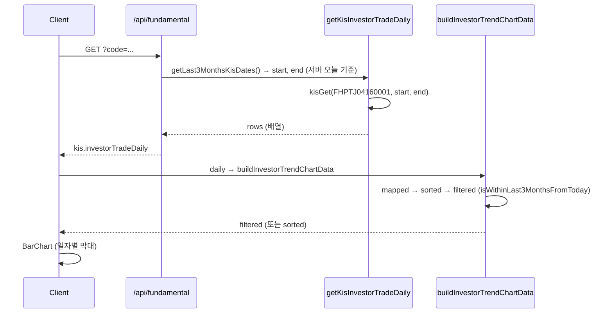

# 투자자 매매동향 3개월 누적 그래프 — 원인 정리 및 수정 계획

## 1. 현재 데이터 흐름

## 2. "12/8 하루만 나온다"의 가능 원인 (단계별)

| 단계                 | 내용                                                                                                              | 12/8만 나오게 만드는 경우                                                                                                                                                                                                                                                               |
| ------------------ | --------------------------------------------------------------------------------------------------------------- | ------------------------------------------------------------------------------------------------------------------------------------------------------------------------------------------------------------------------------------------------------------------------------ |
| **A. API 요청**      | [lib/kis-api.ts](lib/kis-api.ts) `getLast3MonthsKisDates()`로 start/end 계산 후 KIS 호출                              | 서버 날짜 기준으로 3개월 구간 요청하므로, 요청 구간 자체는 넓음. 단, KIS가 실제로 1일치만 주는 경우는 별도 이슈.                                                                                                                                                                                                          |
| **B. API 응답 파싱**   | output/output2/output1 → 배열 또는 컬럼형 전치 → `isInvestorTradeRow` 검사                                                 | 컬럼형인데 전치 실패·검증 탈락 시 `[]` 반환 또는 잘못된 구조. 또는 **한 컬럼만** 반환되면 행이 아니라 날짜 배열만 올 수 있음.                                                                                                                                                                                                 |
| **C. 클라이언트 날짜 필터** | [TickerDetailContent.tsx](components/dashboard/TickerDetailContent.tsx) `isWithinLast3MonthsFromToday(dateKey)` | **핵심.** 클라이언트 "오늘" 기준 `[today-92, today]`만 통과. KIS가 **2024년** 일자(예: 20241028~20241208)만 주면, 클라이언트 오늘이 2026-03-06일 때 limitKey=20251206 이하여서 **전부 제외** → `filtered=[]` → 그때만 `sorted` 전체 반환. 반대로, **일부만** 통과하려면 "오늘"과 같은 해의 12/8(20251208) 한 건만 있어야 함 → **12/8 하루만 나오는 현상**과 일치. |
| **D. 날짜 파싱**       | `normalizeDateStr` / `dateStrToSortKey` (6자리 → 20YYMMDD)                                                        | 6자리가 24MMDD로 오면 2024로 해석. 위 C와 합쳐지면 2024년 데이터는 전부 필터에서 탈락. 파싱 실패(key 0) 행도 `dateKey===0`이면 필터에서 제외됨.                                                                                                                                                                           |

**정리**:  

- **클라이언트가 "오늘 기준 3개월" 필터를 쓰는 한**, KIS가 2024년 구간(10/28~12/8) 데이터만 주면 **전부 날짜 구간 밖**으로 빠져서,  
  - 필터 결과가 0건이면 → `sorted` 전체를 쓰므로 10/28~12/8 전부 나와야 하고,  
  - "12/8 하루만" 나온다면 → **실제로 통과하는 건 1건뿐**이어야 함.  
  즉, **데이터 중 1건만** (예: 2025-12-08 또는 파싱 결과 20251208) **클라이언트 기준 "오늘~3개월 전" 구간에 들어가고, 나머지는 2024년 등으로 해석되어 제외**되는 구조가 반복되고 있을 가능성이 큼.

## 3. 해결 방향: 한 가지 기준으로 통일

**목표**: "3개월 전부터 오늘까지 투자자 매매동향 **누적 그래프**"를 **항상 같은 규칙**으로 표시.

- **표시 구간**: **"수신한 데이터의 최신일 기준, 과거 92일(약 3개월)"** 한 가지로만 사용.
  - 클라이언트/서버의 "오늘"은 사용하지 않음.
  - KIS가 10/28~~12/8만 주면 → 12/8 기준 92일(약 9/8~~12/8)만 차트에 표시.
  - KIS가 12/9~~3/6을 주면 → 3/6 기준 92일(약 12/6~~3/6)만 표시.
- 이렇게 하면:
  - 2024년/2025년 혼선 없이 **가지고 있는 데이터**만으로 3개월 구간을 만들고,
  - "오늘 기준" 필터 때문에 12/8 한 건만 남는 상황을 제거할 수 있음.

## 4. 수정 항목 (최소 변경)

### 4-1. 프론트: 표시 구간을 "데이터 최신일 기준 92일"로 고정

- **파일**: [components/dashboard/TickerDetailContent.tsx](components/dashboard/TickerDetailContent.tsx)
- **삭제**: `isWithinLast3MonthsFromToday` (클라이언트 "오늘" 사용하는 필터).
- **유지·사용**: `isWithin92DaysFromKey(dateKey, maxKey)`만 사용.
  - `maxKey` = `sorted`에서 추출한 유효한 날짜 중 최댓값.
  - `dateKey >= (maxKey 기준 92일 전) && dateKey <= maxKey` 인 행만 포함.
- **로직**: `buildInvestorTrendChartData`에서
  - `sorted`까지 계산한 뒤,
  - `validKeys = sorted.map(dateStrToSortKey).filter(k>0)`, `maxKey = max(validKeys)`,
  - `filtered = sorted.filter(row => isWithin92DaysFromKey(dateStrToSortKey(row.date), maxKey))`,
  - `return filtered.length > 0 ? filtered : sorted` (기존과 동일한 fallback).

이렇게 하면 **항상 "데이터 최신일 기준 3개월"**만 그리므로, 12/8만 통과하는 현상이 사라짐.

### 4-2. 프론트: 누적 그래프로 복원

- **파일**: [components/dashboard/TickerDetailContent.tsx](components/dashboard/TickerDetailContent.tsx)
- **차트**: 현재 일자별 막대(BarChart) → **다시 누적 라인(LineChart)**으로 변경.
  - `buildInvestorTrendChartData` 결과에 대해 `cum개인`, `cum외국인`, `cum기관` 누적 계산 후 `LineChart` + `Line` 3개 (개인/외국인/기관).
- **문구**: "일자별 순매수 수량" → "순매수 수량 누적 (최근 3개월)" 등으로 수정해, **누적**과 **데이터 최신일 기준 3개월**임을 명시.

### 4-3. (선택) API 응답 검증

- **파일**: [lib/kis-api.ts](lib/kis-api.ts) `getKisInvestorTradeDaily`
- **목적**: 12/8만 나오는 게 "API가 1건만 반환"인지, "여러 건 반환인데 프론트에서 1건만 통과"인지 구분.
- **방법**: 개발 환경에서만, 반환 배열 길이와 (가능하면) 첫/끝 행의 일자 필드 로그 한 줄 추가. (예: `console.log("[KIS] investorTradeDaily rows=%s firstDate=%s lastDate=%s", len, firstDate, lastDate)`)

## 5. 기대 결과

- **표시 구간**: "데이터 최신일 기준 과거 92일" 한 가지 규칙만 사용 → 클라이언트 "오늘"과의 불일치로 인해 12/8만 남는 현상 제거.
- **차트**: 3개월 구간의 **누적** 그래프로 복원.
- **KIS가 3개월치를 주는 경우**: 그 구간 중 최신 92일이 누적 라인으로 표시됨.
- **KIS가 1일치만 주는 경우**: 그 1일만 표시되며, 이는 API/제공 데이터 한계로 명시 가능.

## 6. 요약 체크리스트

1. `isWithinLast3MonthsFromToday` 제거, `isWithin92DaysFromKey`만 사용해 필터 통일.
2. `buildInvestorTrendChartData`에서 `maxKey` 계산 후 `isWithin92DaysFromKey`로 필터.
3. 투자자 매매동향 차트를 BarChart → LineChart 누적(cum개인/cum외국인/cum기관)으로 복원.
4. (선택) getKisInvestorTradeDaily에 개발용 로그 추가.

이후에도 12/8 한 건만 보이면, 그때는 **KIS가 해당 종목/기간에 1건만 내려주는지** 로그로 확인하는 것이 다음 단계가 됨.